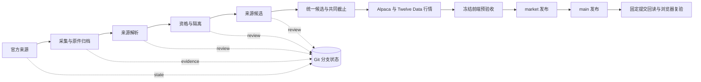
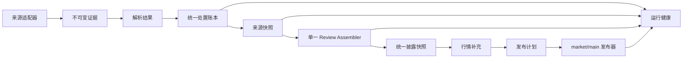

# 2026-09-23 架构审计

## 审计目的

在连续高强度扩展 House、Senate、白宫/OGE 和行情覆盖之后，先停止继续叠加来源特例，核对当前系统的真实结构、主要风险和下一段优化顺序。审计以远端 `code` 提交 `d1d222def6a43b12e3d04b05ce87e3490afe8129` 为代码基线，并对照当前正式 `main`、`market`、Actions 运行结果和冻结消费契约。

## 已验证基线

- 正式前端和公开快照仍可用；当前生产 `main` 为 `31a7ed8406456cea6c4de4be9baad5a2384bcaf6`，`market` 为 `ab51226154bb16156fe9e72ff233e408e3ca2755`。
- 当前代码包含 45 个核心 Python 模块、约 15,513 行核心代码、46 个后端测试文件和 19 个 GitHub Actions 工作流。
- 后端 346 项测试通过；冻结消费契约 29 项测试通过；网关 27 项测试及类型检查通过；冻结前端 dashboard、search、person、ticker 四模式浏览器验收通过。
- 2026-09-23 的 House 增量成功；Senate eFD 和 OGE 增量失败，但失败没有移动正式 `main`。

## 当前结构

核心数据层没有内部模块循环依赖，内容寻址、证据哈希、确定性编码、异常隔离、发布前后验收和旧版保留构成了可靠基础。当前问题主要出现在各阶段之间的状态契约和工作流编排。

## 主要发现

### P0：来源状态只有“成功/失败”，缺少统一的处置模型

Senate 候选构建曾要求 `report_extraction_failure_count == 0`，但发布准备检查又允许已计入覆盖闭合的解析失败。两套门禁对同一状态的解释不一致。另一个隐含冲突是来源 `state` 记录本次采集批次，`review` 记录包含纸质补录在内的累计处置，却曾要求两边的解析成功数、失败数和交易数完全相等。当前 5 份纸质报告已经明确失败并进入隔离，却仍阻止 126 份有效报告和新的目录增量晋级。

应把每份报告明确归入以下互斥状态：

- `accepted`：可以进入来源候选；
- `quarantined`：已解释并隔离，不阻止其他记录；
- `retryable`：临时失败，达到重试条件后再次处理；
- `pending`：尚未处理，阻止声称批次闭合；
- `conflict`：证据冲突，阻止受影响实体晋级。

候选门禁应检查“所有输入都有处置、没有未解释的 pending/conflict”，而不是要求失败数为零。

### P0：同一对象在相邻阶段使用了不同身份语义

OGE 采集层有意保留所有目录出现项，以 `catalog_index` 区分重复行；候选层却要求 `source_document_id` 全局唯一，遇到重复直接终止。2026-09-23 的官方目录中有 35 条完全重复出现项，因此阻断整批增量。

真实回放还发现，官方接口在按日期分页时会让边界记录漂移；同一轮 17 页请求既会重复文档，也可能漏掉此前已经发布的文档。如果候选只相信本轮目录，正式数据会发生无依据的删除。短期修复应在现有 10 MiB 响应上限内一次取回当前有界目录，并把历次已归档目录合并为文档历史；来源本轮缺席不能自动视为披露撤回。

应显式区分：

- `occurrence_id`：目录出现项身份，用于证明官方目录原貌；
- `document_id`：实际报告身份，用于归档、解析和候选晋级；
- `content_sha256`：报告内容身份，用于完全重复和冲突判断。

完全相同的重复出现项可以确定性折叠；同一 `document_id` 对应不同关键字段或不同内容时进入 `conflict`，只阻断该文档。

### P0：业务编排大量存在于工作流 YAML，无法被正常单元测试

19 个工作流共约 3,860 行，其中约 2,459 行是内嵌 shell/Python。状态文件生成、计数闭合、候选组合、分支写入和运行摘要等业务逻辑散落在 YAML 中。现有工作流测试多数只检查某段文字是否存在，无法执行或验证完整状态转换。

这解释了为什么 346 项后端测试全部通过，生产仍出现 Senate 和 OGE 的跨阶段门禁冲突。

应把内嵌业务逻辑移入可测试的 Python 应用层，工作流只负责：准备环境、调用单个命令、发布产物和上报结果。

### P1：`review` 分支没有真正的单写者

多个工作流会直接写入 `review`，但没有全部使用同一个 `disclosure-review-writer` 并发锁。部分工作流只持有 `disclosure-source-writer`。它们可与 House review 或 OGE/Senate review 作业并发，最终通常以非快进推送失败收场。数据不会被静默覆盖，但会制造无业务意义的失败和重跑。

目标结构应由来源工作流只写 `evidence` 与来源级 `state`；一个独立的 review assembler 读取固定的来源提交，统一写入 `review`。短期至少要保证所有 `review` 写入使用同一锁并在写入前核对远端基线。

### P1：失败运行没有进入公开健康状态

Senate 和 OGE 本次失败发生在新的 review 候选提交之前，因此公开 `review/status` 和 `main/source_health` 仍显示上一次成功状态。GitHub Actions 是红色，但消费端无法知道最新尝试失败。

应把“最后尝试”和“最后成功”分开保存：

- `last_attempt_at`、`last_attempt_status`、`last_error_code`、`workflow_run_url`；
- `last_success_at`、`last_success_source_commit`、`published_cutoff_at`。

失败不得改写正式事实，但必须能更新独立的运行健康状态。

### P1：命令入口和候选构建函数过大

`__main__.py` 的 `main()` 约 860 行并负责 44 个子命令；`build_senate_candidate()` 约 367 行，多个来源候选函数在 150 至 240 行之间。参数定义、文件读写、业务规则、审计摘要和错误翻译混在一起，使局部规则难以复用和组合测试。

应拆成：

- `cli/`：参数和输出；
- `application/`：每个用例的编排；
- `domain/`：身份、处置、资格、去重和截止规则；
- `adapters/`：官方站点、Git、PDF/OCR、行情供应商；
- `contracts/`：版本化输入输出模型和验证器。

这是包内重构，不需要拆微服务，也不需要引入数据库。

### P1：契约以散落的字典和字符串维护

核心源码中有大量 `schema_version` 的手工写入和比较，但没有集中式契约注册或版本化 schema。模块之间通过原始 `dict` 传递状态，字段是否必填、允许的状态组合和迁移规则靠每个函数自行判断。

应先为跨阶段对象建立轻量、版本化的 Python 模型和集中验证器：`SourceRunStatus`、`EvidenceRecord`、`ExtractionResult`、`Disposition`、`SourceCandidate`、`PublicationPlan`。不必一次改完所有解析内部结构，优先覆盖跨模块和跨分支边界。

### P1：缺少真实状态演进回放测试

当前测试善于验证单个解析器和单个候选函数，但没有用固定的 `state/review/evidence` 快照回放“采集成功 → 部分隔离 → 来源候选 → 统一候选 → 发布准备”的完整过程。也没有覆盖以下已发生的生产形态：

- Senate 存在已计入隔离的纸质解析失败，同时电子报告继续新增；
- OGE 目录存在完全相同的重复出现项；
- 某来源候选失败，上一版正式数据继续服务，但最新失败状态仍可见；
- 两个来源工作流同时尝试更新 review。

应增加小型、去敏、固定哈希的跨阶段回放夹具，并在 PR CI 中执行。

### P2：运维和项目状态可发现性不足

`实现状态与下一步.md` 已成为按时间追加的长记录，当前状态和历史状态混在一起；本地常用验证脚本依赖调用者先切换到 `backend/`；生产 Action 使用浮动 major 标签而不是固定提交。它们不会直接改变数据，但提高了交接、恢复和供应链维护成本。

应保留一个短的当前状态页，把历史运行记录归档；使验证命令从仓库根目录也可运行；对有写权限的生产 Action 固定到审核过的提交 SHA，并通过受控更新维护。

## 建议目标结构

Git 分支仍可保留为持久层，冻结前端五数组契约也保持不变。变化集中在状态语义和内部职责边界。

## 实施顺序

### 第一批：恢复增量并建立回归证据

1. 修正 Senate 门禁，以“处置闭合”替代“失败数为零”，增加纸质失败共存的回归测试。
2. 为 OGE 增加 occurrence/document/content 三层身份和完全重复折叠，增加冲突重复测试。
3. 重跑 Senate、OGE、统一候选和完整发布，确认共同截止、House 延后记录和公开健康状态。

截至本次审计提交，前两项已实现并用失败运行的真实产物回放：OGE 从 358 个目录出现项折叠出 323 个本轮唯一文档，并从历史目录保留 11 份本轮缺席文档，最终闭合 334 份报告、生成 4,696 条合格交易；Senate 对 131 份目录报告形成 126 份有效解析和 5 份明确失败处置，生成 1,436 条合格交易。下一步是合并代码并在 GitHub 生产工作流中完成统一候选与发布验证。

### 第二批：把生产规则从 YAML 移入代码

1. 建立 `application` 用例层和跨阶段状态模型。
2. 先迁移 Senate、OGE 两条已出故障的 review 编排。
3. 再迁移 House、白宫和完整发布的内嵌脚本。
4. YAML 缩减为参数、权限、并发锁和单一命令调用。

### 第三批：建立单写者和可观察运行状态

1. 来源工作流发布固定来源结果，不直接重建统一 review。
2. 独立 assembler 串行写入 `review`。
3. 建立最后尝试/最后成功双时间线和结构化错误码。
4. 增加失败告警与离线恢复演练。

### 第四批：收束代码和文档

1. 拆分 CLI，集中 schema 常量和验证器。
2. 增加跨分支回放测试和工作流语义校验。
3. 整理当前状态页、历史记录和架构决策。
4. 固定生产 Actions 依赖并补充自动更新流程。

## 哪些问题能由本次优化解决

- Senate 已隔离纸质报告阻断全部增量；
- OGE 官方目录完全重复阻断全部增量；
- 新来源特例不断增加候选构建复杂度；
- review 分支并发写入导致的非快进失败；
- 生产失败只在 Actions 可见、前端健康状态滞后；
- 单元测试全绿但真实工作流仍失败；
- 后续开发难以快速确认某字段、状态和门禁由谁负责。

以下问题仍需各自的数据能力解决，架构优化只能让它们不再阻塞其他数据：特朗普/万斯大体量扫描件 OCR、官方站点不可用、身份本身无法确认、Twelve Data 额度和来源许可。

## 审计结论

当前系统没有需要推倒重写的基础性错误。数据真实性、确定性、证据可追溯和发布保护是可保留的核心。最高优先级是把跨阶段状态变成统一的处置账本，把业务编排从 YAML 移到可测试代码，并建立 `review` 单写者。完成前两批即可直接解决目前 Senate 和 OGE 的主要阻塞；完成第三批后，类似问题将从“整条生产线停止”降为“单条记录隔离并可见”。
