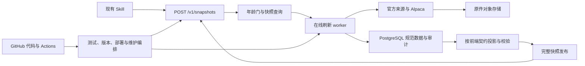

# 政客交易数据服务总体设计

版本：0.2（以前端模块及交接要求为设计基线）  
日期：2026-09-18  
对象：`us-politician-trades-watch` 的数据库、采集、数据服务和维护体系  
状态：原按需刷新路线的设计参考；2026-09-18 用户要求重新评估轻量方案，依赖本路线的实施暂缓。尚未建库或部署。当前讨论建议见 [政客交易 Skill 轻量架构建议](政客交易Skill-轻量架构建议.md)，对方接受调整前不视为已变更接口契约。

## 1. 项目目标与交付责任

**本项目就是为对方已经提供的 `us-politician-trades-watch` 前端/Skill 模块建设配套数据后端。前端模块及交接要求是既定设计输入，我们据此设计采集、数据库、数据接口、运行和维护体系。**

后端设计从每个前端页面和问答场景所需的字段、范围、计算依据、时效和失败行为出发，反推来源适配、存储结构、服务流程和测试。我们负责交付其既有 `POST /v1/snapshots`，输出 `politician-dashboard/v1` 数据，并满足原有刷新和回退要求。

### 1.1 我们交付什么

1. 官方来源采集器、原件归档和解析管线。
2. PostgreSQL 数据结构、迁移、审计和恢复机制。
3. 既定 HTTP 接口、五个 canonical 集合及完整快照发布。
4. 原有年龄门、强制刷新、并发协调、超时及旧快照回退。
5. Alpaca SIP 日线和满足现有统计所需的价格基准。
6. 对方原版模块可直接调用的测试环境、端到端验证证据。
7. GitHub 仓库、测试、发布、维护与 fork 工作纪律。
8. 部署与接入说明：对方使用已有 API 地址/令牌配置项即可接入。

### 1.2 职责划分

| 范围 | 责任与设计依据 |
|---|---|
| 前端/Skill 模块 | 使用交付包既有的路由、处理、渲染与问答实现；作为后端联调对象 |
| 数据后端 | 我们负责来源、事实、数据库、接口、快照、质量、时效与运维 |
| 前端依赖的统计输入 | 我们交付完整可靠的 canonical 记录和价格序列；派生统计遵循原处理器的职责划分 |
| 配置与凭据 | 后端保管上游凭据；前端沿用既有服务地址和可选令牌配置 |
| 文档与代码的差异 | 形成联调核验项，保留真实观察，不通过改造数据掩盖；不预设对方要做额外功能开发 |

### 1.3 总体技术路线

`GitHub 代码与运行编排 + 在线 Python 数据服务/worker + PostgreSQL + 原件/快照对象存储 + 对方现有 Skill`

在线服务承接每条用户消息的刷新检查和同步响应；PostgreSQL 承接规范事实与事务；对象存储承接原件与不可变快照；GitHub 承接测试、版本、部署和维护任务。这个分工由现有 POST 接口、按需刷新及客户端时限共同决定。

后端内部采用何种部署平台由我们选择，但不改变对方已经定义的取数方式。本文不把 GET 替代 POST、另建 v2 schema、用户轮询任务或重写页面列为实施前提。

## 2. 依据与证据等级

本稿依据用户指定的 ZIP、开发交接说明，以及解压后的实际源代码。按照本项目的明确目标，这些材料构成后端的需求基线；材料中的运行指令本身不等于部署、访问受限门户或修改账号设置的执行授权。

| 文件 | 本稿使用目的 |
|---|---|
| [SKILL.md](../review-input/us-politician-trades-watch/SKILL.md) | 路由、官方来源边界、时效说明、问答规则 |
| [data-api.md](../review-input/us-politician-trades-watch/references/data-api.md) | HTTP 接口、canonical 集合、错误与刷新语义 |
| [data-sources.md](../review-input/us-politician-trades-watch/references/data-sources.md) | 来源白名单、采集顺序、年龄门、行情要求 |
| [data-model.md](../review-input/us-politician-trades-watch/references/data-model.md) | 数据含义、时间、所有人、修正件与统计 |
| [frontend-data-map.md](../review-input/us-politician-trades-watch/references/frontend-data-map.md) | 看板、人物页、单股页的输入和计算口径 |
| [fetch_snapshot.py](../review-input/us-politician-trades-watch/scripts/fetch_snapshot.py) | 实际请求、45 秒超时、校验及原子落盘 |
| [process_snapshot.py](../review-input/us-politician-trades-watch/scripts/process_snapshot.py) | 实际接受字段和本地重算行为 |
| [render_dashboard.py](../review-input/us-politician-trades-watch/scripts/render_dashboard.py) | 真实展示和本地聚合行为 |
| [query_snapshot.py](../review-input/us-politician-trades-watch/scripts/query_snapshot.py) | 问答投影、筛选与输出字段 |

交接包 SHA-256：`1D1EE1A74C537C3E0F2B49F7FDB64AA10E85E5AEF47E6C6CC796D67775CE4977`。  
DEV 说明 SHA-256：`46A5F40A158DFE73D55B1A44A6F7812862C4978A393D146BEE8B63A0742B0A72`。

已验证：原包 29 个测试通过；现有客户端/处理器/渲染器已进行代码核对；部分校验和统计行为已复现。  
未验证：真实来源全链路采集、官方门户访问资格、Alpaca 账号权限、实际性能、云端恢复与生产部署。本文的时限、拓扑及验收均是待实现设计，不是已经测得的服务能力。

## 3. 数据服务接口设计

### 3.1 请求和配置

- `POLITICIAN_DATA_API_URL`：HTTPS 服务地址；沿用原客户端的本地调试例外。
- `POLITICIAN_DATA_API_TOKEN`：原契约已有的可选 Bearer token；生产建议配置，具体分发方式由运行平台决定。
- `ALPACA_API_KEY_ID`、`ALPACA_API_SECRET_KEY`：仅在服务端；不进入 Skill、快照、HTML 和普通日志。
- `POST /v1/snapshots`；保留 `schema_version`、`mode`、`scope`、`force_refresh`、`locale`、`include`。
- `mode` 为 `dashboard/person/ticker/search`；除 dashboard 外，`scope.value` 必须提供。语法、身份和范围校验在服务端完成。
- 不要求新请求字段、任务轮询、WebSocket 或客户端增加调用步骤；不向原客户端返回其无法处理的 202 任务响应。

现有 `scope.value` 是字符串，附件没有定义完整 search 语法。首版支持经测试的姓名/稳定 ID、ticker/发行人名称及明确的日期/院别/党派组合，无法明确解释的表达式返回有界错误，不静默忽略条件。用户查询中的姓名解析可以用别名检索，但财务记录归属必须依赖已审核的稳定身份映射。

### 3.2 返回值

使用原契约的 envelope：`refresh` 加 `snapshot`。所有响应均使用 JSON；失败不返回伪造快照。

| 情况 | HTTP | 返回行为 |
|---|---|---|
| 来源仍在有效年龄门内 | 200 | 返回可用快照，`refresh.status=fresh`；不伪造新的上游检查时间 |
| 必要刷新在请求预算内完成 | 200 | 提交并发布后返回完整快照，`refresh.status=fresh` |
| 刷新失败/超出本次等待预算，但存在可用旧快照 | 200 | `refresh.status=fallback`，填写失败来源，返回旧事实快照 |
| 没有可用且兼容的快照 | 503 | 明确不可用，不用演示数据填充 |
| 请求无效/无权限 | 4xx | 使用明确 HTTP 错误；不依赖原客户端显示完整错误正文 |

`meta.snapshot_id` 必填且稳定。服务端返回完整的 `people`、`transactions`、`reported_holdings`、`security_market_data`、`source_health` 数组，即使某一集合为空也不省略。

`summary`、`activity_by_day`、`priority_people`、`top_people`、`top_tickers`、`recent_transactions`、`market_moves` 由原包 `process_snapshot.py` 重算。服务端不把这些字段作为另一套业务真相；提前计算也不能覆盖客户端实现。

### 3.3 时限与快照一致性

客户端默认超时 45 秒。设计服务端最晚在约 35 秒内作出完成/回退/不可用决策，为传输和序列化留余量；这是目标，必须压测证明。

刷新请求触发真实年龄门评估。需要刷新时，由在线 worker 执行，而非排队等待 GitHub runner。长任务超出本次预算时可以在服务器继续；本次请求只能诚实回退或 503，不能宣称后台完成。

数据快照不可变。fallback 的本次失败状态放在原契约的 `refresh` 中，旧快照内的历史 `source_health` 不偷偷改写。原 Skill 陪同说明负责表达 fallback；单独 HTML 的状态展示列入附录 A 的联调核验。

可用数据不变但成功检查记录变化时，可发布新的完整快照；不得只修改原 snapshot ID 对应的部分内容。`data_cutoff_at` 表示所含证据边界，不用请求时间冒充。

### 3.4 scope 与页面跳转

原 HTML 是自包含页面，人物/股票跳转不会自动向后台补取详情。过度裁剪 canonical 数组，会使下钻页面的完整度和统计发生变化。

首版优先返回声明覆盖范围内的完整数据包，scope 用于准确路由查询和确定需要检查的来源；不因 scope 剪掉页面间跳转所需数据。问答继续由原 `query_snapshot.py` 提取证据。

完整包必须通过范围与容量测试。后端优先通过数据索引、缓存、传输压缩及正确的范围闭包满足既有页面跳转；不能偷偷截断或让对方增加分页请求来完成当前交付。若约定规模下确实无法达标，应报告实测容量边界，不虚报通过。

## 4. 来源接口适配

| source_id | 接入设计 | 允许进入规范数据的内容 | 尚待实际接入验证 |
|---|---|---|---|
| house_clerk | 官方年度索引/公开查询、文件下载、版本比较 | House PTR、年度/离职报告和修正件 | 当前索引字段、文档布局、身份映射、访问约束 |
| senate_efd | 官方 eFD 查询及报告读取，保留访问状态 | Senate 对应申报和修正件 | 访问确认、会话与查询行为、机器可读性 |
| oge | OGE/责任机构官方入口；可直接获取则归档，否则待人工获取 | 278-T、278e 及合格修正报告 | 按人/机构的可得性、Form 201 流程、文件格式 |
| house_ethics_guidance | 官方规则页面及版本记录 | 门槛、规则、截止日说明 | 页面变化检测；不得生成交易行 |
| senate_ethics_guidance | 同上 | 同上 | 同上 |
| alpaca_sip_eod | 历史 bars API 和资产参考；服务端鉴权 | 独立日线及保守证券映射依据 | SIP 权限、限流、历史范围、证券覆盖 |

House/Senate/OGE 并不是已经确认有统一、稳定的 JSON 交易 API。来源适配器必须分别实现，不能以“都有 API”为前提估算完成度。

明确不接入 SEC 13F、竞品聚合站、社交媒体、新闻和搜索片段作为交易/持仓证据。原件归档先于 OCR 和归一化；保存官方 URL、内容哈希、发现时间、HTTP 元信息、报告标识及原文定位。

实际访问遇到需要用户确认、Form 201 或控制访问的步骤，保留 `manual_request_pending`，不自动代办。公开数据的用途及行情对外展示权限需在生产发布前核实；这里只给工程接入设计。

### 4.1 保留刷新年龄门

| 来源 | 普通请求触发重查的最短年龄 |
|---|---:|
| House | 30 分钟 |
| Senate | 60 分钟 |
| OGE/机构可得性 | 6 小时 |
| 两院规则、人物/职位映射 | 24 小时 |
| Alpaca | 新的已完成美股交易日，收盘后加 30 分钟缓冲 |

它们不是必须全天执行的定时任务。`force_refresh=true` 绕过年龄门，但不绕过访问限制、限流、重试边界和刷新锁。首版不添加改变此语义的常态定时采集；首次回填、修复和运维检查使用独立管理任务。

### 4.2 行情

- 显式请求 `feed=sip`、`timeframe=1Day`、`adjustment=split`，逐页处理 `next_page_token`。
- 根据美股交易日历、时区、提前收市和发布缓冲确定截止；排除未完成 session。
- 至少覆盖 24 个月加基准缓冲；记录请求参数、provider 截止、代码映射和响应批次。
- 资产 API 只作唯一精确发行人匹配；不确定 ticker 保留空值。
- SIP 不可用时，不用其他 feed 或合成价格顶替。可以返回仍有效的旧合格序列并标明来源延迟，或者让相关行情集合缺失该证券。
- 不能只因为原处理器接受 `source_id` 就认定行情合格；服务端独立检查 feed/timeframe/adjustment、日期和价格。
- 对原包会重算收益的事件，必须保证序列覆盖相应基准。无法取得完整历史时，不提供会使处理器误用序列起点的半截行情；按证券整体不可评估处理，并记录覆盖损失。相关边界列入附录 A 的联调核验。
- 拆股调整后，需重新校验/重拉受影响历史，不能将不同调整基础的价格直接拼接。

## 5. 业务架构

服务四类业务：总体看板、人物查询、证券查询、组合筛选/证据问答。业务链路为：

`发现 → 归档 → 分类 → 解析 → 身份核对 → 证券核对 → 修正/去重 → 规范数据事务 → 快照发布 → Skill 消费`

业务规则：

1. 只有 `official_matched` 进入生产交易/持仓数组；其他状态保留在审计与覆盖记录中。
2. PTR/278-T 只产生交易记录，不累计重建持仓。
3. 最新已核实年度/离职/278e 报告产生持仓快照；数据库保留历史，但当前 canonical 持仓不混入多个时期。
4. 本人、配偶、共同、子女和未知所有人分开保存。
5. 买卖方向不能自动转成建仓/清仓。持仓报告差异也不自动证明某日交易或彻底退出；缺证据用 unknown。
6. 金额是披露区间，不取中点，不产生净流入/净头寸。
7. 交易日、申报日、发现日、检查时间和价格日分开保存。
8. 没有覆盖、尚未解析、官方没有新增是不同状态；不把采集失败变成“没有交易”。

对 v1 未定义表达方式的金额（缺失或无上限）和无法确证的记录，原文完整入库，进入可复核覆盖记录，不伪造数值送入 canonical。实际覆盖率和未纳入原因必须可查；这些真实来源场景进入联调核验，不被当作正常记录静默丢弃。

## 6. 数据架构

### 6.1 分层及建议表组

| 层次/表组 | 核心数据 | 约束 |
|---|---|---|
| people / official_ids / offices | 稳定人物身份、官方标识、任期、优先级 | 姓名非主键；身份变更有历史 |
| filings / filing_versions | source+官方编号、报告类型/期、文件版本、修正关系 | 官方编号与内容版本分开；不覆盖旧版 |
| raw_documents | 对象地址、SHA-256、官方 URL、获取时间、HTTP 信息 | 同 URL 新内容产生新对象 |
| parse_runs / parsed_rows | 解析器版本、原文区域、字段及异常 | 可离线重跑；保留每次输出 |
| transactions / transaction_versions | owner、资产、方向、日期、金额、证据 | 稳定业务记录与解析版本分开，避免重跑重复计数 |
| holding_reports / holding_items | 完整报告及资产行、期末日期 | 必须以报告为单位认定完整性；不能逐行拼出“最新持仓” |
| securities / identifier_mappings | 证券身份、ticker历史、匹配依据 | 代码不是永远不变的证券主键 |
| market_batches / daily_bars | 日线、交易日、调整基础、来源批次 | 同证券同日期同版本唯一，价格有限且大于零 |
| source_checks / checkpoints | 尝试、成功、扫描进度、归档与解析进度 | 原件已发现不等于解析已完成 |
| review_items / review_decisions | 疑义、证据、审核结果、审核者和时间 | 人工修正也生成版本，不改原件 |
| refresh_jobs / source_leases | 持久任务、重试、锁租约、代次 | 执行者失去租约后禁止提交 |
| snapshots / snapshot_members | 内容版本、成员、源版本、哈希、发布状态 | 完整快照发布后不可变 |

### 6.2 去重、修正及进度

- 分开识别下载重复、相同官方申报重复索引、解析器重跑与真正修正申报。
- 只对已确认的修正关系应用替代；不能仅按更晚日期猜测。
- 原件归档成功可以推进归档进度；解析失败保留待处理项，不能越过后永久遗漏。
- 财务规范行和相应规范化进度原子提交。来源失败不能清空旧数据或推进未完成的扫描水位线。
- 发现按官方发布/索引变化推进，并保留回看窗口；不能用交易日期作为唯一增量水位线。
- 新版解析器重跑先输出差异，再决定发布，不能用“程序成功”替代业务复核。

### 6.3 时间和范围

保留报告原始日期及精度。如果官方只有日期，没有精确时刻，数据库记录 `date_precision`，不声称知道具体申报分钟。v1 的 offset timestamp 投影采用统一、记录在案的日期表示方式；24 小时统计的精度列入附录 A 的联调核验。

`meta.data_cutoff_at` 不作为全部来源已完整覆盖的声明。发布清单保存每个来源的检查、证据边界和行情基准，服务响应保留原字段。

## 7. 系统架构

推荐单代码库的模块化 Python 后端：HTTP API、来源适配器、解析器、规范化、数据库访问、快照投影和运行维护。采用 PostgreSQL 保存事实与任务；初期无需另建 Redis/消息平台，持久任务表负责领取和重试。

### 7.1 刷新与锁

锁按来源和规范化覆盖范围设置，而不是按用户原始查询字符串。dashboard 与 person/ticker 范围重叠时，复用覆盖它的来源任务，不能各自同时扫描和覆盖进度。

锁使用带到期时间、持有者和代次的数据库租约。续租、完成和写入都校验当前代次；过期执行者恢复后不能发布。外部抓取不占用长事务，短事务负责最终提交。

同一来源连续失败使用有界重试和退避；`force_refresh` 不绕过退避保护。任务持久化，API 进程重启不丢任务。不要把仅存在内存中的异步函数当可靠队列。

### 7.2 快照发布

1. 原件写入不可变对象并校验哈希。
2. 解析、核对和规范记录在数据库事务中提交。
3. 在一致性读取视图中构建五个 canonical 数组，固定所用来源与行情版本。
4. 使用冻结的原包处理器检查能否被实际客户端接受；另做更严格的后端事实检查。
5. 生成发布 snapshot ID，写入完整、不可变快照对象与清单。
6. 上传/校验全部完成后，通过数据库短事务激活快照引用。
7. 读方固定一个 snapshot ID；不跨版本拼数组。

对象存储和数据库不是一个跨系统事务。通过“先上传完整对象，最后激活数据库引用”实现可见性一致；中断产生的未激活对象可以后续清理，不能被读方误认为正式快照。

首版若本次必要来源刷新失败，遵循原合同返回上次成功快照。不要擅自发明客户端不认识的 partial 状态或把新旧来源拼装后称 fresh；允许的部分覆盖通过明确的来源状态表达，并经契约样本验收。

## 8. 物理架构与权限

| 部署位置 | 内容 | 说明 |
|---|---|---|
| GitHub 私有仓库 | 后端、契约副本、测试、迁移、基础设施说明、运行手册 | 唯一可维护代码来源 |
| GitHub Actions | 离线 CI、镜像构建、部署编排、人工维护入口 | 不在每次用户请求里启动 runner |
| 在线容器运行环境 | Python HTTP API 与刷新 worker，共用一份构建镜像、不同进程 | 推荐 FastAPI 类轻量 HTTP 层；供应商后续选定 |
| PostgreSQL | 规范事实、任务、锁、审计、快照注册 | 独立持久存储，具备备份恢复 |
| R2 或等效对象存储 | 原件、快照、构建证据 | 原件与可清理产物分区、权限分开 |
| Skill 运行环境 | 原版脚本与一次性缓存 | 只有读服务凭据，不持有源站或发布凭据 |

首版不额外引入 Cloudflare 网关、Kafka、微服务集群或多区域主库；直接使用稳定 HTTPS 入口。容器平台、数据库供应商和存储区域属于尚未决定的物理部署项，不影响对外 v1 契约。

开发、测试、生产用独立数据库/存储空间和凭据。原件归档、数据库迁移、快照读取、发布分别最小授权；密钥不放 Git、HTML、fixture 或错误响应。

正常 worker 无权删除原件。原件按内容哈希保存，正常流程只能新增；生产前设置保留/防覆盖控制及独立备份，不能仅把文件命名规则当不可变保障。

## 9. 前端模块驱动的数据设计

| 前端模块 | 后端必须提供 | 对应交付与验收 |
|---|---|---|
| 固定 30 天人物卡 | 稳定 people、priority、完整窗口交易 | 使用原排序、chips 与方向汇总；不生成 demo 字段 |
| 30/90 买入共识 | 交易、ticker、人物、行情 | 由原代码分组；不预加多人买入门槛 |
| 热门股票与交易表 | 完整窗口记录、金额、所有人、两类日期 | 不以分页截断影响合计；原筛选和排序保留 |
| 人物交易页 | 人物关联全部约定范围记录 | 不把只含单股的子集伪装成全人物历史 |
| 人物价格表现 | 合格完整价格序列 | 按既有本地重算提供基准；验证样本、收益和展示，代码行为核验见附录 A |
| 单股页 | 关联人物、交易、24 月价格及上季基准 | 缺少充分历史的证券保守不提供行情，不伪造收益 |
| 调仓分类 | 分类、依据、证据 | 无充分证据返回 unknown；不推断建仓/清仓 |
| 来源模块 | 官方 source_id/URL、时间、status | 一来源一行；fallback envelope 的 HTML 展示有局限 |
| 问答持仓 | 最新完整合格持仓报告的全部行 | 不由交易累加；数据库历史独立保留 |
| 人物/股票问答 | 关联证据、金融事实、行情 | 服务端按准确身份/代码筛选，原 query 投影继续使用 |
| 自包含头像 | 原代码已支持的官方 URL/data URI 字段 | 按原格式供给并验收，不假定新头像字段会被使用 |

未知 ticker、日期精度、无上限金额、需要手动获取的报告和深层跳转范围都纳入边界验收；不能把演示 fixture 的漂亮展示等同于这些生产情况已支持。

## 10. 测试体系与验收

### 10.1 测试基线

冻结原 ZIP 及脚本哈希，将其直接作为端到端测试的前端模块。保留原有 29 项测试，并由我们新增后端和联调测试。验收必须运行对方提供的脚本，不能以另写一个简化客户端替代真实联调。

真实证据样本经允许获取后形成小型黄金集：House/Senate/OGE 各种报告、一个修正链、扫描件、未知证券、配偶记录、无法解析记录。每份附官方地址、哈希、页/行位置和人工预期结果。离线测试不反复访问官网。

### 10.2 必测场景

| 类别 | 场景 | 验收依据 |
|---|---|---|
| 来源 | 超时、429、503、验证页、空索引、损坏 PDF | 有界失败，不清空历史，不误推进水位线 |
| 身份 | 同名、换任期、配偶、模糊 ticker | 不串人、不猜归属，疑义可复核 |
| 披露 | 一份多行、重复下载、修正局部行、文件原地址变内容 | 业务记录幂等；修正前后均可追溯 |
| 金额 | 缺失、零、开放上限、反转 | 不造零，不编上界；不支持项隔离并计覆盖 |
| 行情 | IEX/分钟线、缺页、未收盘、假日、拆股、缺历史 | 独立门禁，不靠改标签“修复” |
| 合同 | 四种mode、force、200 fallback、503、空集合 | 原 `fetch_snapshot.py` 实际运行成功或按约定失败 |
| 并发 | 重叠scope、重复请求、锁到期、旧worker恢复 | 复用任务；旧worker不能覆盖新结果 |
| 发布 | 每个提交/上传/激活边界中断 | 旧版或新版完整可读，绝不混版 |
| 前端 | 原脚本生成看板及问答，同一证据跨页面比对 | 不只验证 HTML 文件存在；检查业务数值和交互 |
| 恢复 | 上游离线，从备份和原件恢复指定版本 | 数据/哈希/统计对应，不只看数据库启动 |

测试结果分别归因到后端实现、上游可得性和既有模块行为。现有模块与说明不一致时保留失败证据，按附录 A 管理；不篡改交易或价格让断言通过，也不把它自动转成要求对方改造的前置任务。

### 10.3 执行时机与性能

- PR：离线规则、契约、迁移与受影响集成测试。
- 来源适配器修改：受控、小规模真实访问验证，不绕过门户要求。
- 每次发布快照：来源与证据门禁、引用完整性、价格覆盖、原包消费验证。
- 软件发布：原版客户端贯通测试、浏览器交互、fallback、并发和恢复演练。
- 性能：缓存命中目标 P95 5 秒内；冷/强制刷新在服务端预算内完成或回退，并在原客户端 45 秒限制下测试。首次回填不纳入普通查询时延承诺。

性能测试记录人物数、交易数、行情点数、文件体积、网络条件与并发数。响应时间目标未实测前不写成 SLA。

## 11. 维护体系

### 11.1 运维与数据质量分开

记录来源最近尝试/成功、发现/归档/解析/隔离数量、待复核年龄、价格缺口、当前快照版本、fallback/503 比例、时延、锁等待、任务重试与存储增长。

“任务成功”与“新数据可用”是不同结果。原 `official_match_rate` 不能当全库覆盖率；管理侧以全部已发现申报为分母独立统计。

### 11.2 告警与复核

- 哈希损坏、身份错配、混版、无资格数据进入 canonical：停止发布，立即告警。
- 有实际请求却持续只能 fallback、后台任务超时、来源连续失败：按约定可用性阈值告警。
- 30/60 分钟年龄门不是服务故障阈值；无人请求时不因越过年龄门报警。
- 合并重复告警，只在恶化、恢复或需要人工动作时通知。
- 人工复核处理身份/证券疑义、修正关系、OCR 不确定及解析器升级差异；记录证据、决定、理由、人员和时间。
- 通知渠道上线前选定，本文不创建通知或授权向外发送信息。

### 11.3 恢复、回退与记录

代码回退、快照回退、数据库恢复分别有操作入口。数据回退不删除新原件；错误解析可从已有原件重建，不必重新申请全部官方文件。

建议建立：来源不可用、解析回归、行情权限、发布失败、快照回退、数据库恢复六份短 runbook。配置停止采集和停止发布的独立开关，读取旧快照继续工作。

生产前必须验证数据库备份及对象存储独立恢复副本。保留期限、恢复时间目标、可接受数据损失窗口在真实规模与平台确定后定稿；不得只凭“已有旧对象”宣称可恢复。

日常以异常队列为主；每周抽样核验及处理积压；每月/重大迁移后恢复演练。`WORK.md` 保留当前状态、关键决定和恢复点，不复制所有聊天。

## 12. 对方要求到后端交付的追踪表

每项后端实现、测试和发布检查都要能回到下表的一项要求。技术选型服务于这些要求，不自行改变前端取数和业务口径。

| 编号 | 对方既定要求 | 我们的设计与实现责任 | 交付证据 |
|---|---|---|---|
| R01 | 每条消息调用既有 POST，支持四种 mode | 第3节 HTTP 服务、范围解释、请求校验 | 原版 fetch 四模式请求通过 |
| R02 | 五个 canonical 数组及稳定 snapshot ID | 第6/7节关系数据、统一投影、完整快照 | schema检查与同版本消费结果 |
| R03 | 官方披露白名单 | 第4节三个独立适配器、官方来源注册表 | 每个样本可追到原件和页/行 |
| R04 | 原件先归档、哈希、不可变 | 第6/8节对象存储、文件版本与权限 | 同URL内容变化仍保留两版 |
| R05 | 稳定人物ID与保守证券匹配 | 第5/6节身份和证券映射 | 同名/任期/模糊ticker测试 |
| R06 | 修正件和去重，不删除历史 | 第6节业务版本与替代关系 | 重跑幂等及局部修正差异 |
| R07 | 交易与持仓分开，持仓只取最新合格报告 | 第5/6节独立报告实体及当前视图 | PTR不产生持仓、历史不混入当前 |
| R08 | 按需年龄门与force_refresh | 第4/7节刷新决策、持久任务、租约 | 年龄门边界、强刷和重叠scope测试 |
| R09 | fallback/503及真实来源时间 | 第3节响应约定、第11节运行记录 | 失败及超时的原版客户端结果 |
| R10 | Alpaca SIP、日线、拆股复权、完整翻页 | 第4节行情适配和质量门禁 | 请求记录、交易日与缺页测试 |
| R11 | 金额区间、所有人、交易日和申报日准确 | 第5/6节字段保真与证据保留 | 人工黄金样本逐字段核对 |
| R12 | 30/90看板、人物页、单股页互通 | 第9节所需数据、范围闭包及统一快照 | 使用原版页面的跨页数值与交互测试 |
| R13 | 问答证据投影与持仓查询 | 第3/9节查询范围与完整持仓 | 原版query输出及官方证据链接 |
| R14 | 不推断调仓、不伪造价格和缺失值 | 第4/5节依据门禁、unknown和审计记录 | 错误/缺失/不确定样本测试 |
| R15 | 并发、原子提交、有界重试、日志脱敏 | 第7/8/11节协调、发布与运行维护 | 故障注入、恢复、脱敏检查 |

实施时为每项记录负责模块、关联 PR、运行证据和当前状态。当前均属于设计承接，不能因为填写了追踪表就标记为已实现或已验收。

## 13. GitHub 版本迭代与 fork 纪律

### 13.1 仓库与版本

一个主仓库管理后端、接口契约、测试、基础设施与运行手册。对方 Skill 的交付版本与哈希固定为联调基线；后端每次变更都对这个真实模块验证，避免前后端各自演进而失配。

建议目录：`backend/`、`contracts/`、`migrations/`、`tests/fixtures/`、`tests/frontend-contract/`、`infra/`、`docs/`。这是实施时的建议结构，本稿不创建这些产品目录。

分别记录：软件版本/commit SHA、对外 v1 schema、数据库迁移版本、解析器版本、身份/证券映射版本、原包基线哈希、snapshot ID。每份发布清单串联这些信息及所用原件/行情批次。

数据库内部可以演进；对外 v1 不借内部迁移静默改变含义。软件发版和日常数据快照发布分开。生产运行固定、已验收的构建版本，不直接跟随未发布的 main 最新提交。

### 13.2 正常迭代

`明确问题与验收 → 最新main短分支 → 修改 → 离线测试 → PR → 最终提交校验 → 测试环境 → 发布版本 → 生产验证`

- 契约或解析器变更附前后数据差异，不只贴测试通过。
- 审查和测试绑定提交 SHA；审查后代码有变，重跑受影响检查。
- 数据库迁移在备份副本先演练，优先兼容扩展，再切换代码，最后清理旧结构。
- 生产紧急修复从已发布版本分出，修复后同步 main，不保留无人维护的永久分叉。
- 不将原件、完整生产导出、密钥或生成 HTML 全部提交到代码历史；合法可分发的小型测试样本另行审核。

### 13.3 分支、worktree、fork

日常内部并行开发用“短分支 + 独立 worktree”；GitHub fork 用于外部贡献或需要仓库权限隔离的合作。Codex 对话 fork 不是文件隔离，不能代替 worktree。

每项工作记录目标、基线提交、修改范围、验收条件和实际目录。不同 Agent 不同时编辑同一工作副本；重叠模块由一方负责整合。

fork 不持有生产 secrets、不执行生产采集/部署定时任务、不发布正式快照。外部 PR 先在无生产权限的测试环境运行，不能为了方便而开放生产凭据，也不能用特权事件执行未经审查的 fork 代码。

修改通过 PR 合回，不靠复制“最终版/最终修复版”目录同步。主分支、共享分支与正式标签不强制改写历史。合并后确认未提交内容再清理分支及 worktree。

### 13.4 账号能力边界

当前为 GitHub Free 个人账号，仓库私有。官方文档说明，私有仓库的强制分支保护/rulesets 需要相应付费计划。当前可执行 PR、CI 和发布纪律，但不能把文档约定写成已经强制生效的平台保护。

生产发布凭据仅供受控发布流程使用；若日后需要多人协作下的不可绕过门禁，须配置支持的权限与套餐或独立发布控制。这不是本稿已经完成的设置。

## 14. 实施阶段与交付验收

| 阶段 | 交付物 | 通过标准 |
|---|---|---|
| A 需求基线 | 原包哈希、R01-R15追踪表、页面数据映射、接口样例 | 每项对方要求有后端设计及验收用例 |
| B 接口最小贯通 | 本地/测试服务、数据库迁移、固定合格样本 | 原版 fetch → process → render/query 全链可运行；不改原脚本 |
| C 一个真实来源 | 原件归档、解析、身份、修正与快照 | 人工核验样本一致，重复运行不增加假记录 |
| D 全来源与行情 | 三来源适配、人工待办、SIP管线 | 各来源真实可用性已验证，缺失/待办不伪装成功 |
| E 发布与恢复 | 并发控制、故障回退、版本及恢复手册 | 45秒边界、旧worker、上传中断、离线恢复演练通过 |
| F 生产准备 | 实际部署、凭据/访问确认、告警与发布流程 | 真实容量及恢复实测；联调问题有明确结果 |

首次历史回填由管理任务完成，不让第一位用户承担全部抓取时间。若用户请求范围尚未回填且没有可用快照，按合同返回 503；不返回错误的“无交易”。

最终交付包括部署好的数据服务、接入配置说明、数据覆盖清单、R01-R15验收记录和维护手册。验收同时看实际接口、前端模块运行、业务数据准确性、来源覆盖和故障恢复，不能只测HTTP 200。附录 A 中尚未核实或解决的实际问题继续出现在联调记录中，不掩盖。

## 15. 后端实施参数与联调准备

1. 在线容器、PostgreSQL、对象存储的供应商与区域。
2. 首批人物范围、回填历史长度，以及如何保证人物/股票下钻范围完整。
3. 官方来源访问及产品用途确认、需人工获取的文件流程、Alpaca 权限。
4. search 字符串的支持范围、歧义处理及真实查询样本。
5. 无上限金额、精确申报时刻缺失等 v1 表达限制的覆盖策略。
6. 备份保留、恢复目标、告警渠道、运行容量。
7. 附录 A 的核验样本和预期结果；区分后端应修正的数据问题与既有模块的计算/展示行为。

## 16. 官方参考

- [House Financial Disclosure](https://disclosures-clerk.house.gov/FinancialDisclosure/ViewSearch)
- [Senate eFD](https://efdsearch.senate.gov/search/home/)
- [OGE disclosure quickstart](https://www.oge.gov/web/OGE.nsf/publicresources_disclosure-quickstart)
- [Alpaca historical bars](https://docs.alpaca.markets/us/reference/stockbars)
- [GitHub protected branches](https://docs.github.com/en/repositories/configuring-branches-and-merges-in-your-repository/managing-protected-branches/about-protected-branches)
- [GitHub rulesets](https://docs.github.com/en/repositories/configuring-branches-and-merges-in-your-repository/managing-rulesets/about-rulesets)
- [GitHub Actions secrets](https://docs.github.com/en/actions/how-tos/write-workflows/choose-what-workflows-do/use-secrets)

这些资料用于核对平台与来源约束，不能替代生产账号权限测试和端到端验收。

## 附录 A. 联调需核实的既有模块行为

本附录保留代码检查发现，供联调归因和验收使用。它不是另一个“兼容改造项目”，也不作为要求对方先修改模块才能开始后端建设的任务单。能在后端保证的数据约束由我们负责；仅由现有页面决定的行为，用真实样本呈现差异，不修改事实来掩盖。

| 编号 | 已观察的行为 | 我们的处理与核验方式 |
|---|---|---|
| J01 | 处理器的new_filings及filing_count按交易行计数，不按filing去重；当前渲染器未直接展示这些字段 | 完整提供真实filing_id及所有交易行；用一份多行申报验证。后端预计算会被覆盖，不能删行来改变结果 |
| J02 | 人物页偶数样本“中位数”取上中位，空样本中位数/方向吻合率默认0 | 用[2,10]及空样本核验；保持真实收益，不编造价格或修改样本。此行为不能通过额外后端统计字段覆盖 |
| J03 | 客户端仅核HTTPS；feed/timeframe会被写成固定标签 | 后端独立核实官方来源和真实行情参数，不把客户端通过当来源已验证 |
| J04 | 缺失金额默认0，明确null被拒绝；开放上限无完整表达 | 完整保存原文，正确区间进入规范输出；不支持项可追溯、可复核并计入覆盖记录，不能伪造上界 |
| J05 | 价格基准函数未判断现有历史是否覆盖事件起点 | 后端提供所需历史；不足时明确不可评估，不传会产生错误基准的半截序列 |
| J06 | HTML来源模块不读取本次refresh；问答还会筛选source_health | 完整返回refresh.failed_sources及约定来源字段，测试Skill整体说明与HTML单独打开的表现；旧快照不能悄悄改成新状态 |
| J07 | HTML跳转只使用嵌入DATA，没有补数请求 | 后端按页面关联关系交付完整范围，测试连续下钻，不能用局部数据冒充完整人物统计 |
| J08 | 官方只有日期时，24小时统计没有精确时间依据 | 数据库保留日期精度，记录统一投影方式，使用跨时区边界样本验证，不声称未知时刻已确定 |
| J09 | 价格图无障碍标签含固定“模拟日线”，时间标签固定24个月 | 用真实生产样本和短上市历史样本验证标签；后端不伪造历史或注入脚本改变模板 |
| J10 | official_match_rate仅基于已纳入canonical的记录 | 后端管理侧另算全量发现/解析/核验覆盖率，不能把这个比例当全源完整度 |

来源为本次固定哈希的交付包。联调报告注明代码位置、输入、实际输出、预期口径与归因。上述观察不会因文档改为总体设计而自动消失，也不代表已经完成端到端验证。
