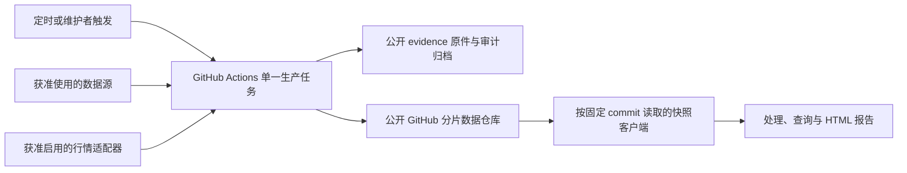

# 政客交易数据服务总体设计

版本：0.3（定时快照路线；依据 unison 增量契约修订）  
修订日期：2026-09-21
对象：政客披露 Skill 的采集、数据生产、快照分发、维护和联调  
状态：公开 GitHub 生产仓库、定时 House 采集、证据归档、异常队列、空快照发布和回退控制面已经上线，见[实现状态与下一步](实现状态与下一步.md)。自动事实晋级、完整披露与行情回填、来源使用批准和原前端验收尚未完成，因此生产 `main` 仍为 `bootstrap_empty`。

**本稿是当前总体设计入口。首版路线改为定时批处理、版本化分片和公开 GitHub 固定提交读取，不再以在线 Python API、PostgreSQL 或 Cloudflare 为必需组件。** Cloudflare 代理保留为以后改回私有仓库时的可选层。本稿区分对方契约原要求、我们建议的修订以及上线前待确认项，不把建议写成双方已批准的合同。

> 2026-09-18 执行调整：当前目标和优先级以[当前目标与优先级](当前目标与优先级.md)为准。逐条人工复核门禁、空快照先行交付和独立 D 阶段优先级已被替换；现阶段直接以完整披露、行情和原前端端到端验收为目标。

旧路线保留在 [v0.2历史稿](政客交易数据服务-总体设计-v0.2历史稿.md)；此前的 [轻量架构建议](政客交易Skill-轻量架构建议.md) 和 [契约与数据使用审阅](unison-契约适配与数据使用审阅.md) 是决策依据。交接包与后续交接说明共同构成唯一前端/消费契约基线，原始材料均不修改。

## 1. 修订依据与决定状态

| 增量信息 | 本稿如何吸收 | 状态 |
|---|---|---|
| 用户要求减少复杂度、潜在成本，复用10大V项目思路 | 后台统一采集，查询读取已发布数据；移除首版常驻采集服务及托管数据库 | 当前设计方向 |
| 后续交接说明提出 `hash-sharded-v2`、单workflow单job、只读代理 | 作为正式传输契约输入；复用分片、确定性编码与发布纪律 | 已固定为生产侧实施基线 |
| 交接说明自述消费端完成、57项测试通过 | 接受为交接边界；生产侧按说明实现并运行本项目契约测试 | 不是另一套待交付前端；57项不计入本方实测 |
| 交接契约存在主分支混版、健康缓存、市场历史回收等实施风险 | 在生产侧用固定commit、保留策略和阻断性测试闭合 | 不要求额外前端改造，不静默修改接口 |
| 官方披露限制及行情再分发问题 | 增加按来源、用途和交付方式判断的授权门槛 | 未获得本产品适用结论或许可 |
| 讨论替代行情/披露供应商 | 设计可替换适配器，列候选但不直接替换原白名单 | 未选型、未购买、未授权接入 |

已核对材料：

- [增量交接说明HTML本地留档](../review-input/unison-data-contract.html)，SHA-256：`d8cb58c9ac38fcdb69a12db090a2abb9eb20b17492b48fbac264c1661e8b68f8`。
- 原交付包SHA-256：`1D1EE1A74C537C3E0F2B49F7FDB64AA10E85E5AEF47E6C6CC796D67775CE4977`；DEV说明SHA-256：`46A5F40A158DFE73D55B1A44A6F7812862C4978A393D146BEE8B63A0742B0A72`。
- [原Skill](../review-input/us-politician-trades-watch/SKILL.md)、[数据来源](../review-input/us-politician-trades-watch/references/data-sources.md)、[数据模型](../review-input/us-politician-trades-watch/references/data-model.md)、[页面映射](../review-input/us-politician-trades-watch/references/frontend-data-map.md)、[原处理器](../review-input/us-politician-trades-watch/scripts/process_snapshot.py)。
- 交接包29项测试已实际通过；交接说明自述的57项属于对方交接状态，不计入本项目实测，也不产生等待另一套前端的阶段。

原附件的POST、用户触发强制刷新、请求内fallback要求与后续交接说明冲突时，以当前交接说明确定的定时快照和固定版本读取方式为准。材料中的命令、创建仓库或接受条款指示不自动构成本次操作授权。

## 2. 产品目标与业务架构

继续服务看板、人物查询、股票查询和证据问答。保留官方披露事实、交易与持仓区分、证据链和数据截止说明。用户请求不触发上游采集；“最新”指最新成功发布版本，不指刚刚检查了官方来源。

两条独立业务链：

```text
生产：计划/维护者触发 → 来源检查 → 原件归档 → 解析核对 → 修正去重 → 校验 → 发布
消费：用户提问 → 固定发布版本 → 下载所需分片 → 本地组装/查询 → 生成报告
```

当前交付目标只有一个：完整提供交易、合格持仓、人物/股票查询、官方证据、来源健康、日线行情和交易后标的表现，然后由现有交接前端完成验收。披露数据候选和无行情页面只用于增量联调，不是正式上线档位。未获得行情分发许可时保持生产发布关闭，不用空数组、零收益或删减前端功能冒充完整交付。

## 3. 系统与物理架构



| 组件 | 首版职责 | 运行与成本边界 |
|---|---|---|
| [公开GitHub仓库](https://github.com/hunterhigh/us-politician-trades-data) | `code` 保存代码，`main` 保存规范快照，`state` 保存检查点，`evidence` 保存官方原件，`review` 保存未复核产物 | 已上线；主数据历史不强制重写；持续监测仓库增长 |
| GitHub Actions | 分离 CI、来源归档、复核、正式发布和回退；各生产 workflow 使用统一并发纪律 | 已上线；House 每 6 小时有界运行，空跑仍消耗运行时间但不产生无意义数据提交 |
| 公开GitHub读取器 | 解析分支 commit、按固定 commit 读取、验哈希和组装 | 不保存写凭据；公开直读比代理路径多一次 commit 解析请求 |
| Cloudflare Worker（以后可选） | 改回私有仓库后提供鉴权和允许路径代理 | 不是公开首发依赖；现有实现与测试保留 |
| 原件及审计存储 | `evidence` 保存原始 PDF/XML/ZIP 与获取元数据，`review` 保存解析输出和异常 | 首版使用公开 Git；消费端不把原件作为运行时数据。接近 GitHub 容量边界时再迁移对象存储 |
| 行情存储（可选） | 有许可后保存当前及约定保留期内的市场版本 | 默认关闭；Git市场分支与对象存储方案需解决历史可达性 |
| Skill运行环境 | 临时缓存、完整性验证、组装和生成报告 | 不是事实数据库；不含上游密钥或GitHub管理凭据 |

首版无需托管PostgreSQL、常驻Python应用服务器、Redis或数据库租约系统。允许批处理使用本地SQLite做可重建的工作索引，但不得把runner临时磁盘或Actions cache当唯一持久存储。

与10大V仓库复用的是“提前处理、清单发布、读取固定数据”的方式，不照搬高频多job矩阵，也不重复每轮重写大型聚合文件。新契约中的仓库体积与增长数字是对方测量陈述，需在实际生产样本上独立验证。

## 4. 数据架构与事实规则

### 4.1 持久化分层

| 层 | 保存内容 | 完整性要求 |
|---|---|---|
| 原件证据 | 官方URL/编号、原始字节、哈希、下载时间、允许保存的响应信息 | 先归档后解析；同URL变化保留新版本；不把分片哈希当原件哈希 |
| 解析与审计 | 解析器版本、页/行定位、字段、错误、待人工申请/复核记录 | 可离线重跑；不支持的记录也可追溯，不只保留成功行 |
| 规范事实 | 人物、任期、证券、申报、交易、持仓、修正关系 | 稳定ID、幂等、明确版本与来源；规范分区按来源/申报等组织 |
| 页面物化 | people/tickers/board及可选market分片 | 由规范事实生成；不是唯一证据或唯一历史账本 |
| 发布与运维 | 内容清单、版本引用、检查进度、运行状态、恢复记录 | 事实版本和健康状态分开；读取方使用明确的一对版本 |

索引扫描、原件归档、解析完成和发布水位分别记录，避免“发现了但解析失败”的记录永久漏过。增量按官方发布/索引变化并结合回看窗口发现，不能只按交易日期增量抓取。

### 4.2 业务约束不因简化而降低

1. 只有符合获准来源规则、证据充分的记录进入规范数组。`official_matched` 必须有实际官方核验依据。
2. PTR/278-T产生交易；年度、离职、278e完整合格报告产生持仓。不得累计交易重建持仓。
3. 本人、配偶、共同、子女、未知所有人分别保存；姓名不是主键，ticker不是永久证券主键。
4. 金额保留区间；缺失或开放上限无法由当前schema表达时，保留原件及排除原因，不造零、不编上界、不取中点。
5. 建仓、加仓、减仓、清仓仅使用有明确依据的分类；未知不进入相应效果统计。
6. 交易日、申报日、发现时间、检查时间、行情日期分开。只有日期的材料保留精度，不声称知道准确时刻。
7. 申报修正与解析器重跑分别版本化，只有确定的修正关系才替代规范行；旧证据保留。
8. “无新增”“未覆盖”“待解析”“来源失败”分别表示，不能把后几种状态输出成没有交易。

五个规范数组仍是 `people`、`transactions`、`reported_holdings`、`security_market_data`、`source_health`。派生统计由固定版本处理器计算；不在后台另造一套不一致的统计口径。

## 5. 交接消费契约与生产侧闭合

### 5.1 可以保留的约定

- 业务schema：`politician-dashboard/v1`；存储布局：`hash-sharded-v2`，两者分别版本化。
- 代理路径：`GET /v1/<ref>/<path>`；不再以旧 `POST /v1/snapshots` 为首版必交付接口。
- 实体类为 `people/tickers/market`；人物键原样，ticker/market键按约定转大写。
- 桶路径由 `sha256(class + "\x00" + normalized_key)` 的前两位hex确定。
- 实体分片路径采用自身原始字节的SHA-256；规范编码使用：

```python
json.dumps(value, ensure_ascii=False, sort_keys=True, separators=(",", ":")).encode("utf-8")
```

生产者在编码前拒绝NaN、Infinity和不合法数据类型；不要改变序列化参数后仍声称同一哈希契约。数组排序由稳定业务键确定，否则语义不变也会生成不同摘要。

| 路径 | 内容及变化方式 |
|---|---|
| `manifest.json` | 可变发布入口；实际读取先解析到确定commit |
| `people/<h2>/index.json`、`tickers/<h2>/index.json` | 当前键到内容摘要的映射，可变但必须随版本固定读取 |
| `people/<h2>/<digest>.json` | 人物、交易、持仓、行情依赖，按内容新增 |
| `tickers/<h2>/<digest>.json` | 股票关联事实与人物、行情依赖，按内容新增 |
| `board/<digest>.json` | 自包含看板/搜索覆盖包；不能假定随语料增长仍恒定150 KB |
| `market/<h2>/{index,<digest>}.json` | 可选市场版本；需要固定引用和明确保留策略 |
| `status/*` | 维护输出；不直接暴露内部日志或凭据，用户可见健康由约定元数据表达 |

相同内容复用旧文件；摘要路径在正常发布中不重写。披露事实分片优先不固化每日变化的价格标量或派生收益；若对方模块确实需要，必须标明关联市场版本，并将其造成的主分支每日新增字节纳入容量测试，不能声称行情分支分离后已消除这部分增长。保留/清理只能在明确的快照保留及许可政策下处理，不笼统承诺任何数据永不删除。

### 5.2 生产侧必须闭合的契约事项

| 编号 | 文档缺口 | 本稿建议及验收 |
|---|---|---|
| C01 | 单次Git提交被当作多次HTTP读取的原子保证 | 首次解析主分支commit；manifest、所有主分支索引和分片固定此commit。代理用响应头等方式提供引用，不进入交付HTML；并发发布期间测试不能混版 |
| C02 | `market_commit`列为建议字段 | 启用市场分支时必须有固定市场commit；市场先可读，再发布引用它的主清单 |
| C03 | 内容ID不变就完全不提交，同时要求健康时戳更新 | `snapshot_id`继续作事实内容ID，另加元数据/健康revision；内容不变可更新小型健康清单，客户端仍更新来源状态 |
| C04 | 同snapshot ID即复用缓存，未定义请求范围 | 缓存键还包含模式、规范化scope、依赖预算、处理器版本和布局；元数据缓存单独更新 |
| C05 | 256桶被视作索引≤8KiB的数学上限 | 改为容量目标；定义实测上限、拒绝发布/扩容策略。单人物全历史和board也要测字节数 |
| C06 | 市场孤立提交每日替换，却要求旧快照可重现 | 保留期内保留不可变Git ref，或使用对象存储；主清单里的SHA文字不是Git可达引用 |
| C07 | fetch后检查本地 `HEAD==BASE_SHA` | 比较刷新后的远端目标SHA与BASE_SHA，普通非强推；冲突后基于新基线重新组装校验 |
| C08 | 依赖超限丢弃与缺失硬失败混用 | 先规范化去重并稳定排序；计划内依赖缺失硬失败，预算外未加载明确列出及标记覆盖损失 |
| C09 | 任意search只读board，但board范围未定义 | 明确时间、人物和证券覆盖；范围外不得回答全库无记录；姓名到官方ID解析必须有路径 |
| C10 | 原件证据不可变被等同分片哈希 | 原件及解析证据独立归档，读端无需增加原件分片 |

C01–C04涉及读取行为或元数据，必须在交接契约允许的范围内实现并用现有基线验证。生产侧不能悄悄改变已冻结的可观察语义；确需改变时应明确升级布局或schema版本，不借旧名称掩盖变化，也不把修改前端作为默认解决办法。

### 5.3 内容ID、健康版本与复现性

业务内容ID建议对布局、board摘要、人物/股票/行情索引的规范化映射及必要的稳定业务配置计算摘要，不掺入run_id、检查时间或轮次号。算法须在两端固定，并测试同内容重跑逐位相同。

健康版本包含实际检查状态、成功时间和截止事实；即使业务内容ID未变，也可能变化。客户端必须刷新它。`generated_at`表示内容实际生成时间，检查时间不能冒充新内容生成；旧契约字段若需改义，须同步修订文档和测试。

复现目标为：固定内容版本、元数据版本、查询范围、预算和处理器版本后，输出确定。同内容ID对应的不同健康时间不应被误称整个输出逐字节永远相同。不加入逐消费者的 `fetched_at`；生产仓库名称、ref、密钥不嵌入可分享HTML。

## 6. 调度、发布和读取

### 6.1 调度与年龄门

首版 House 证据归档与状态同步采用每 6 小时一次的 schedule，每次顺序处理有界批次；正式事实快照继续人工发布。运行分钟、来源延迟和 `evidence` 分支增长必须持续记录，实测超出预算时先降低批量或频率，不削弱哈希、检查点和证据门禁。

House30分钟、Senate60分钟、OGE6小时、指引/人物映射24小时继续作为来源最小复查间隔，不等于系统保证每隔该时间运行。市场只处理新完成的美股交易日，考虑提前收市、假日、DST和至少30分钟发布缓冲；实际可见时间还受调度及处理耗时影响。

用户说“今天/最新”仅重新读取已发布入口；不绕过计划启动上游。维护者补采可以绕过年龄门，但不能绕过授权、限流、人工步骤和串行发布纪律。

### 6.2 单写者发布流程

1. 生产workflow统一concurrency group；定时、手动补采和重放都经过同一发布通道。禁止其他脚本直接写生产数据分支。
2. 获取远端基线BASE_SHA及上次持久检查/归档/解析进度，判断本轮到期来源。
3. 在允许的访问方式下采集；先归档原件再解析。失败保留旧事实、真实状态及待办，不推进未完成水位。
4. 规范化、修订、身份和证券核验，生成本轮候选事实；行情仅在许可和功能开关均允许时处理。
5. 用交接包冻结处理器进行build/validate，另做来源、证据、引用、覆盖和许可门禁。生产器输出与交接基线不一致时停止发布，不把告警等同兼容性保证。
6. 构建确定性分片与索引，计算内容ID。内容无变化不写重复大文件；健康更新独立节流处理，保留最新实际尝试记录。
7. 如启用市场分支，先发布并固定市场版本、确认其可读；再构建主分支清单。
8. 再取远端SHA并与BASE_SHA比较。若变化，基于新基线重建一次；仍冲突则失败保留现版。普通push负责最终竞争检测，不强推主分支。
9. 用一次主分支提交公开一致的manifest、索引和分片集合。记录发布证据与健康，不把失败的候选当成已发布数据。

原件存储在同一仓库的独立 `evidence` 分支，但与 `main` 事实发布仍不是同一 Git 事务。通过“原件分支先成功、检查点随后推进、规范事实引用最后可见”保证数据闭合；原件已成功而事实发布失败时保留证据，不影响现版。规范事实发布水位只在发布成功后推进。

初期建议必需来源刷新失败时保留上一完整事实版，同时更新失败状态。仅部分来源更新的发布需先定义逐源截止及覆盖展示；不假定客户端能正确表示混合新旧来源。

### 6.3 读取与失败语义

- 公开首发客户端通过GitHub API将分支解析为固定SHA；随后按该SHA取manifest、索引和分片，逐个验哈希，再在临时文件中组装，全部通过后原子替换输出。以后转私有时由Worker完成版本解析与鉴权。
- 生产失败、旧版仍完整：继续提供上一成功内容，带本次可见健康状态及截止时间，不声称已刷新。
- 本次读到损坏摘要、缺失的计划内对象或不支持的schema：按交接契约硬失败，不拼接缓存或演示数据。
- 无已发布内容：返回明确不可用；鉴权、非法路径等返回相应4xx。错误显示用现有交接基线实测。
- 完整本地旧缓存是否能在网络失败时使用，按后续交接说明不自动回退。若以后恢复该能力，应有显式陈旧状态与测试。

请求数量只是上界估算。人物模式依赖预算是否包括主分片、索引共桶如何复用、缓存命中如何计数，由实际读取器和契约测试确定，不能直接把文档公式当性能结果。

## 7. 访问、范围和前端验收

公开首发客户端固定GitHub owner/repo，只构造GitHub API与raw内容地址，不接受任意基础URL；只读取manifest及约定索引/分片路径，拒绝目录穿越。可选GitHub token只发往API主机，不发往raw内容主机。以后转私有时，Worker继续执行代理key与GitHub只读凭据分离、路径白名单和缓存隔离。

发布job使用写权限，Worker只读；同仓库workflow可用其 `GITHUB_TOKEN`。如果以后拆成代码仓库和数据仓库，不能假定该token跨仓库可写，应另配置最小范围授权。

| 模块 | 需要保证的范围与行为 |
|---|---|
| dashboard / search | board声明人物、日期、证券覆盖和截断状态；局部集合不能给出全库结论 |
| person | 姓名/别名准确解析至稳定ID；提供约定范围的人物交易、最新完整持仓及足够身份信息 |
| ticker | 股票身份、相关人物和完整约定窗口；不能把单股子集当人物完整历史 |
| 页面跳转 | 原HTML只读内嵌数据；分片必须满足约定页面关联范围，否则需明确局部范围或由对方改变补数方式 |
| 行情及派生表现 | 基准覆盖充足、价格日明确；缺失不变成零，超过依赖预算的缺口可见 |
| source_health | 实际检查和成功时间、错误、截止时间；用户分享HTML后仍能看懂其历史时点 |
| 问答与持仓 | 不把无覆盖当无交易，不累加PTR推算持仓；每个结论可回到证据 |

首版容量是待实测参数，不承诺看板恒定150KB、每桶恒定8KiB或全量搜索恒定传输体积。超限不能静默截断；先明确覆盖/窗口，再协商分页或新布局。

## 8. 数据来源、用途与行情许可

### 8.1 官方披露

默认候选仍为House Clerk、Senate eFD、OGE/责任机构；规则页只提供规则背景，不产生交易。访问门户、人工声明及Form201保持真实流程，不自动冒名确认或绕过。

商业用途限制与新闻媒体向公众传播的例外，需要结合实际运营主体、用户范围、收费及交付方式判断。媒体例外不能只靠自称、勾选身份、改产品名称或增加免责声明取得；对方是媒体，也不能自动推定我们的独立商业供数行为被涵盖。法律涉及取得或使用报告，不能一律等到上线当天才检查。

应准备真实产品说明、样例报告、双方角色、公开/订阅方式、API及下载行为，由熟悉美国披露规则的律师评估，并向相应披露办公室核实具体访问规则。本文不是合格媒体身份认定，也不替代法律意见。

### 8.2 行情许可与候选

**行情默认不进入对外发布，直到本产品的实际展示、下载、衍生计算、缓存和保存方式有明确许可依据。** 个人免费/付费API访问权不等于再分发权，日线或延迟数据也不当然例外。

| 候选 | 当前判断 | 待确认 |
|---|---|---|
| Alpaca | 原包固定源；普通访问不可推定允许分发；当前官网条款存在书面同意路径，不能说绝无授权可能 | SIP日线与HTML内嵌/转发、派生数据、保留和上游交易所许可；通知不等于获批 |
| Twelve Data | 有Business商业展示方案；再分发仍需单独协议 | 日线来源覆盖、拆股调整、可下载报告权限和实际报价 |
| EODHD | 有Custom下载和合同路径；内部使用套餐不可外传 | 指定数据集是否满足价格口径，外部分发范围及报价 |
| Massive | 有商业美股历史数据方案 | 是否覆盖本产品全部交付方式及费用可接受性 |
| Quiver | 属于整理好的披露数据候选，不是行情源的同类替换 | 商业再分发、官方证据、修正/持仓/OGE覆盖以及法定用途依据 |

候选均未采购、未获得授权。原包只认 `alpaca_sip_eod`；如换源，要与对方共同调整白名单、provider/feed字段、真实复权口径与测试，不能给其他数据贴Alpaca或SIP标签。Quiver等也不能未经官方核验就冒充官方采集记录。

行情启用后保留以下质量要求：完整翻页、仅完成交易日、拆股调整基础一致、序列严格有序且无重复、明确历史范围。24个月只是显示目标；涉及更早事件的收益必须有正确基准，不能拿序列第一天替代缺失的事件时点。替代源的含分红复权不能静默当作仅拆股复权。

正式首版包含交接前端要求的行情和表现功能。无法取得当前固定行情源的生产许可时，应先解决许可或在交接契约允许的真实标签下选择替代源，不能以省成本为由删除已承诺功能或给替代数据冒用Alpaca/SIP标签。

## 9. 测试体系

| 测试组 | 关键用例 | 通过标准 |
|---|---|---|
| 交接基线 | 固定交接包、处理器、渲染器与后续交接说明；运行现有29项和生产侧契约测试 | 记录真实命令、提交和结果；57项只作为交接说明自述，不混入本方实测 |
| 来源事实 | 同名/配偶、修正链、缺失及开放金额、扫描件、未知ticker | 人工黄金样本一致；原件可追溯，排除原因可见 |
| 确定性 | 同事实重跑、数组重排、非有限数、编码变化 | 稳定业务顺序产生相同内容ID；非法输入拒绝 |
| 读取一致性 | manifest与index间插入发布、market替换、跨模式缓存 | 不混版、不串scope；旧固定版本在保留期内可读 |
| 健康状态 | 无新增但成功检查、连续失败、恢复、内容ID不变 | 用户状态及时按约定更新，不伪造检查或截止时间 |
| 幂等及发布 | 重跑、同源URL换内容、非快进、市场成功主分支失败 | 不重复事实；现版完整，异常可恢复 |
| 依赖及规模 | 大桶、热门人物、全历史board、超过max-shards、缺计划内分片 | 按约定拒绝或显式降级，不把覆盖不足当完整统计 |
| 行情 | 权限拒绝、错误feed、拆股、缺历史、无行情档、替代源标签 | 无不合格数据和伪造表现；业务口径明确 |
| 端到端 | 新fetch→实际processor→query/render，四mode及连续页面跳转 | 事实、统计、覆盖说明正确，不只验证HTML存在 |
| 代理与恢复 | 非法路径、未授权缓存命中、凭据脱敏、备份离线恢复 | 无越权，恢复到指定内容与元数据版本 |

PR用离线样本；合成数据只用于明确标识的测试，生产禁止演示数据。真实样本在获准取得/使用后纳入有证据的黄金集。每次发布做引用、哈希、业务质量和来源许可门禁；来源适配修改才做受控真实访问，不在所有PR反复抓官网。

性能分别测代理响应、分片下载、处理器计算和HTML生成。交接包中的45秒超时作为现有历史基线，实际总耗时由固定交接包、完整候选规模和网络条件验证；不延续原方案“35秒内现场刷新”的承诺。轻量路线的目标是让查询不等待采集。

## 10. 维护、保留与恢复

运行指标包括实际最后尝试/成功、发现/归档/解析/排除数量、覆盖窗口、待复核年龄、发布内容ID及健康revision、代理错误、批次分钟、下载字节、Git与归档增长。官方匹配率不能代替全量覆盖率。

停止采集、停止发布、暂停行情分发分别可控。来源故障保留旧事实；身份错误、哈希损坏、混版或未获许可数据进入候选时停止该次发布。鉴权和许可失效时不能无条件继续向用户分发旧内容，应按许可处置与既定流程执行。

建立来源不可用、解析回归、授权变化、发布冲突、快照回退、归档恢复六份短手册。异常去重，按恶化/恢复/需人工行动通知；本文不指定对外接收人或启动通知。

保留政策需列明：披露规范数据、原件、市场版本、健康历史、代码与schema的期限和删除规则。市场采用孤立提交时，保留期内应有实际ref或归档；只在JSON里保存SHA不保证可恢复。不得承诺GitHub会及时回收或CDN永远持有旧数据。

备份包括Git引用及对象、许可允许的原件/行情、规范分区、清单和解析版本。用上游断网场景恢复一次证明可用，不能只检查备份文件存在。恢复目标和可接受损失窗口依据试点容量定稿。

## 11. GitHub 版本迭代与 fork 纪律

初版采用同一受控仓库管理生产代码和数据，减少跨仓库写权限。`code`、`main`、`state`、`evidence`、`review` 分别承载代码、规范事实、运行检查点、官方原件和未复核机器产物。生产任务固定已验收的代码提交/版本，并记录到发布证据；日常数据commit不等于代码发版。

同时记录：生产代码版本、业务schema、布局版本、处理器版本、解析器/身份映射版本、内容ID、健康revision、主数据commit及可选市场commit。任何改变用户可见含义的调整都需契约测试，而非只保证JSON可解析。

内部开发用短分支与独立worktree；变更经PR、离线测试和最终提交核验后发布。数据发布单写者；开发者不手工修改生产摘要文件。外部fork不带生产secrets、不启用正式采集或发布，不用特权PR事件执行未审查代码。

主分支、共享代码分支和正式标签不强制重写。若保留市场分支替换做法，作为明确的派生数据例外：仅专用发布流程可操作，使用预期旧SHA防止覆盖竞争，并先满足保留政策；不把这个例外扩展到主数据历史。

当前公开仓库已启用 active rulesets：五个生产分支禁止删除和非快进更新，`published/*` 标签禁止删除和非快进更新；这不替代 PR 审核和单写者纪律。对方交接模块保持不变，交接包与交接说明以固定版本共同参与联调，不在双方副本中各改一套。

## 12. 成本边界与运行预算

成本分开统计：Actions执行、分片/原件存储、Worker请求及资源、可选行情许可、可能的OCR处理。行情许可可能高于基础设施成本，不能继续把整个产品估成每月10–30美元；此前数字只是未实测的小规模基础设施情景。

月运行分钟估算：`每日批次 × 30 × 每批所有job计费分钟 + CI + 重试 + 回填`。若一天4次且每批3–5分钟，基础采集约360–600分钟；若一天8次则约720–1,200分钟。均为假设，不是测量，更不含全部任务。账号其他私有仓库也占共享额度，旧截图不能当作当前可用预算。

手动试点已测得每批 25 份 PDF 的来源归档约 45–47 秒，复核解析批次约 25–40 秒；当前据此采用每 6 小时、每批 25 份。继续观察全量回填后的仓库增长与日常空跑，再调整频率、超时、依赖缓存与容量阈值。减少 job 重复启动和大文件重写，不用频繁拆任务凑免费，也不为省费公开受限数据。无变化的任务不提交大文件但仍消耗运行时间。

免费额度、价格和GitHub调度规则以上线时官方规则及账号状态为准。定时任务可能延迟/丢弃；60天无活动自动停用的官方说明针对公开仓库，不用它为私有仓库心跳提交作必然解释。健康心跳可为监控保留。

## 13. 要求追踪与变更对照

| 原编号 | v0.3处理 | 验收证据 |
|---|---|---|
| R01 POST四mode | 按后续交接说明改为只读快照读取；四业务模式保留 | 固定版本交接读取链路真实运行 |
| R02 五数组/版本 | 保留业务schema，增加分片与内容/健康版本区分 | 同版本组装、元数据更新、跨scope缓存测试 |
| R03 官方白名单 | 保留；第三方仅列候选，不直接放行 | 原件核验与来源/用途记录 |
| R04 原件不可变 | 保留，和处理后分片哈希分开 | 原件字节及修订版本可恢复 |
| R05 稳定身份 | 保留，补姓名到分片键路径 | 同名、别名、任期和未知ticker测试 |
| R06 修正去重 | 保留，采用批处理规范分区版本 | 重跑幂等和修订差异 |
| R07 持仓口径 | 保留 | PTR不产生持仓，完整报告不混期 |
| R08 按需/force | 替换为计划与维护者触发，用户不启动采集 | 取数不派发workflow；用户时效说明同步 |
| R09 fallback | 区分生产失败仍读现版与读取损坏硬失败 | 交接错误语义、现版保留、健康呈现测试 |
| R10 Alpaca SIP | 改为授权后启用；替代源需共同修改白名单 | 许可范围、真实feed/复权和口径测试 |
| R11 字段真实性 | 保留 | 人工证据样本逐项核验 |
| R12 页面互通 | 保留目标，增加分片覆盖与容量约束 | 静态下钻与范围外查询测试 |
| R13 问答证据 | 保留 | 交接query与官方证据一致 |
| R14 不造推断 | 保留，增加无行情档验证 | 缺失不当零、无伪造效益 |
| R15 在线锁事务 | 替换为单写者、固定Git版本和原件先行 | 非快进、两分支发布、中断恢复测试 |

表中“替换”表示后续交接说明已经取代早期在线接口路线；生产侧按当前交接说明实现，不再等待另一套前端确认。

## 14. 分阶段交付与下一步

| 阶段 | 交付 | 进入下一步的依据 |
|---|---|---|
| A 契约基线 | 固定交接包与交接说明、C01–C10生产侧处理结果、覆盖和时效约定 | 现有前端和生产侧契约测试可验收，不等待另一套消费端 |
| B 生产基础 | 合成数据的生产→分片→固定版本读取/渲染，以及发布、回退和恢复 | 哈希、范围、健康、并发发布和错误测试通过 |
| C 披露生产 | House、Senate、OGE的交易、持仓、身份、修订和证据归档 | 范围内文件均有规范事实、隔离或明确排除状态，覆盖可证明 |
| D 行情生产 | 经许可的行情、基准、公司行动、历史范围和市场版本 | 分发许可、真实标签、保留和业务口径全部通过 |
| E 完整候选 | 五组规范数组、来源健康、证据引用和共同截止 | 生产构建器与完整性门禁通过，无演示或伪造字段 |
| F 前端验收与发布 | 现有交接前端四类入口、浏览器交互、正式`main`与回退 | 全功能端到端通过并完成生产读取检查 |

当前 A/B 已完成，C阶段的House、Senate和OGE主要电子披露链路已投入GitHub生产。House已归档395份PTR，形成93人、3225笔候选交易；Senate已归档130份当前PTR目录与入口，121份电子报告形成23人、1435笔候选交易，9份纸面报告的52张官方扫描页已归档；OGE已覆盖16,662条目录和5,108份278-T，333份可直下官方PDF全部归档并生成当前解析结果，形成80人、4,696笔候选交易，下载/解析失败和待归档均为0，6,803项异常继续隔离。三源统一候选为196人、9,356笔交易；House与Senate子集已通过交接包处理器和渲染器，新增OGE后的三源候选已通过生产构建与完整性门禁，仍需补跑原前端全模式验收。4,775份OGE请求型报告仍需要Form 201受控入站。正式持仓、生产行情和完整五数组候选尚未完成，`main`仍为`bootstrap_empty`。动态数量以各来源在`state/status/`与`review/status/`中的状态为准。下一步收敛隔离与请求型/扫描型披露、完成合格持仓和经许可行情，再用现有交接前端完成全功能验收。

如未来必须每次查询现场刷新，或文件规模、用户个性化写入和并发任务已超过批处理能力，再评估在线服务与PostgreSQL。届时沿用规范事实、稳定ID、证据归档和适配器，而不是重新构建前端；v0.2仅作升级参考，不自动恢复实施。

## 15. 参考与证据范围

- [House使用限制](https://disclosures-clerk.house.gov/FinancialDisclosure/ViewSearch)、[Senate eFD声明](https://efdsearch.senate.gov/search/home/)、[OGE使用FAQ](https://www.oge.gov/web/oge.nsf/publicresources_disclosure-faq)：官方披露用途限制与新闻传播例外。
- [Alpaca再分发说明](https://alpaca.markets/support/redistribute-alpaca-api)、[官网链接的条款](https://s3.amazonaws.com/files.alpaca.markets/disclosures/library/TermsAndConditions.pdf)：普通访问与书面同意边界；不是本项目已获许可。
- [Twelve Data使用说明](https://support.twelvedata.com/en/articles/5332349-commercial-and-personal-usage)、[EODHD商业方案](https://eodhd.com/commercial-pricing)、[Massive商业方案](https://massive.com/business-stocks)、[Quiver国会交易接口](https://api.quiverquant.com/datasets/congress-trades)：候选资料，不是采购结论。
- [GitHub Actions计费](https://docs.github.com/en/billing/concepts/product-billing/github-actions)、[调度说明](https://docs.github.com/en/actions/reference/workflows-and-actions/events-that-trigger-workflows#schedule)、[Workers价格](https://developers.cloudflare.com/workers/platform/pricing/)、[R2价格](https://developers.cloudflare.com/r2/pricing/)：预算及运行约束。

以上来源在2026-09-18讨论中核对。源网站规则、供应商条款和套餐应在实际接入前复查；本稿未核验生产账号权限，未进行供应商谈判。

## 附录 A. 交接消费模块发现的保留事项

下表来自交接ZIP代码检查。它们是生产侧联调用例，不应通过修改真实数据让测试“通过”；后续交接说明声称测试通过也不替代本项目对实际交接包的回归验证。

| 编号 | 原版观察 | v0.3核验 |
|---|---|---|
| J01 | new_filings/filing_count可能按交易行计数 | 同一申报多行样本验证，禁止删真实行来凑统计 |
| J02 | 偶数中位数取上中位，空样本出现0 | [2,10]和无行情档验证；缺失不能误呈现为0表现 |
| J03 | 来源/feed校验和标签有固定值行为 | 新供应商需要真实标签和独立门禁 |
| J04 | 缺失金额默认0，null和开放上限不完整支持 | 保留原件、排除原因与覆盖，不制造数值 |
| J05 | 历史不足时可能误用序列首日作基准 | 事件基准覆盖测试；不足则不可评估 |
| J06 | HTML不读旧refresh envelope，问答筛选source_health | 新健康版本需在真实HTML与问答中可见 |
| J07 | HTML仅靠内嵌DATA下钻 | 分片闭包、局部范围提示及跨页面一致性测试 |
| J08 | 只有申报日期时24小时口径精度不足 | 保留日期精度，验证时区边界与文案 |
| J09 | 行情图含“模拟日线”和固定24个月标签 | 真数据、短历史、无行情三类展示检查 |
| J10 | official_match_rate仅基于已纳入规范数组记录 | 运维独立计算发现/解析/匹配覆盖，不能替代全源完整度 |
