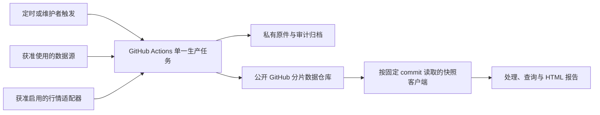

# 政客交易数据服务总体设计

版本：0.3（定时快照路线；依据 unison 增量契约修订）  
修订日期：2026-09-18  
对象：政客披露 Skill 的采集、数据生产、快照分发、维护和联调  
状态：已开始实现本地合成数据原型，见[实现状态与下一步](实现状态与下一步.md)。尚未创建生产仓库、部署代理或上线采集；新消费端代码及数据使用授权尚未完成核验。

**本稿是当前总体设计入口。首版路线改为定时批处理、版本化分片和公开 GitHub 固定提交读取，不再以在线 Python API、PostgreSQL 或 Cloudflare 为必需组件。** Cloudflare 代理保留为以后改回私有仓库时的可选层。本稿区分对方契约原要求、我们建议的修订以及上线前待确认项，不把建议写成双方已批准的合同。

旧路线保留在 [v0.2历史稿](政客交易数据服务-总体设计-v0.2历史稿.md)；此前的 [轻量架构建议](政客交易Skill-轻量架构建议.md) 和 [契约与数据使用审阅](unison-契约适配与数据使用审阅.md) 是决策依据。原版附件与新HTML均不修改。

## 1. 修订依据与决定状态

| 增量信息 | 本稿如何吸收 | 状态 |
|---|---|---|
| 用户要求减少复杂度、潜在成本，复用10大V项目思路 | 后台统一采集，查询读取已发布数据；移除首版常驻采集服务及托管数据库 | 当前设计方向 |
| 新HTML提出 `hash-sharded-v2`、单workflow单job、只读代理 | 作为新版传输契约输入；复用分片、确定性编码与发布纪律 | 已读文档，代码待核验 |
| HTML自述新消费端完成、57项测试通过 | 要求取得相应代码、测试与版本，实际重跑 | 对方陈述，非本方已验证事实 |
| 新契约存在主分支混版、健康缓存、市场历史回收等缺口 | 纳入契约修订清单和阻断性测试 | 待双方对齐，不静默修改接口 |
| 官方披露限制及行情再分发问题 | 增加按来源、用途和交付方式判断的授权门槛 | 未获得本产品适用结论或许可 |
| 讨论替代行情/披露供应商 | 设计可替换适配器，列候选但不直接替换原白名单 | 未选型、未购买、未授权接入 |

已核对材料：

- [新版契约HTML本地留档](../review-input/unison-data-contract.html)，SHA-256：`d8cb58c9ac38fcdb69a12db090a2abb9eb20b17492b48fbac264c1661e8b68f8`。
- 原交付包SHA-256：`1D1EE1A74C537C3E0F2B49F7FDB64AA10E85E5AEF47E6C6CC796D67775CE4977`；DEV说明SHA-256：`46A5F40A158DFE73D55B1A44A6F7812862C4978A393D146BEE8B63A0742B0A72`。
- [原Skill](../review-input/us-politician-trades-watch/SKILL.md)、[数据来源](../review-input/us-politician-trades-watch/references/data-sources.md)、[数据模型](../review-input/us-politician-trades-watch/references/data-model.md)、[页面映射](../review-input/us-politician-trades-watch/references/frontend-data-map.md)、[原处理器](../review-input/us-politician-trades-watch/scripts/process_snapshot.py)。
- 原包29项测试此前通过；尚未取得新版 `snapshot_repo.py` 和对应57项测试。原测试通过不证明新版链路通过。

原附件的POST、用户触发强制刷新、请求内fallback要求与新HTML冲突时，不能同时声称完全满足两者；以双方确认并固定版本后的新契约为实施基线。材料中的命令、创建仓库或接受条款指示不自动构成本次操作授权。

## 2. 产品目标与业务架构

继续服务看板、人物查询、股票查询和证据问答。保留官方披露事实、交易与持仓区分、证据链和数据截止说明。用户请求不触发上游采集；“最新”指最新成功发布版本，不指刚刚检查了官方来源。

两条独立业务链：

```text
生产：计划/维护者触发 → 来源检查 → 原件归档 → 解析核对 → 修正去重 → 校验 → 发布
消费：用户提问 → 固定发布版本 → 下载所需分片 → 本地组装/查询 → 生成报告
```

待双方确认的交付档位：

| 档位 | 功能 | 启用条件 |
|---|---|---|
| 披露基础档（建议首版优先） | 交易、合格持仓、人物/股票查询、官方证据和更新时间 | 披露取得与使用依据明确；无行情场景的页面和统计验收通过 |
| 行情增强档 | 加入日线图、交易后标的表现等 | 对外展示/下载/再分发和保存权限明确，行情适配测试通过 |

基础档不能被描述为原完整功能已交付。行情为空时不制造价格、零收益或空样本排名；同时移除各分片中未获许可的价格标量、派生指标与market依赖。新契约目前仍包含行情要求，禁用方案需双方确认。

## 3. 系统与物理架构



| 组件 | 首版职责 | 运行与成本边界 |
|---|---|---|
| 公开GitHub仓库，候选名 `unison-data` | 生产代码、测试、流程、manifest、索引及披露分片 | 尚未创建；主数据历史不强制重写；监测仓库增长 |
| GitHub Actions | 一个主要workflow、一个生产job；受控并发地执行来源步骤 | 首发公开仓库；空跑仍计运行时间但不产生数据提交 |
| 公开GitHub读取器 | 解析分支 commit、按固定 commit 读取、验哈希和组装 | 不保存写凭据；公开直读比代理路径多一次 commit 解析请求 |
| Cloudflare Worker（以后可选） | 改回私有仓库后提供鉴权和允许路径代理 | 不是公开首发依赖；现有实现与测试保留 |
| 原件及审计存储 | 原始PDF/HTML、解析输出、异常与历史备份 | 建议R2或等效对象存储；消费端不直接访问，保留和费用待定 |
| 行情存储（可选） | 有许可后保存当前及约定保留期内的市场版本 | 默认关闭；Git市场分支与对象存储方案需解决历史可达性 |
| Skill运行环境 | 临时缓存、完整性验证、组装和生成报告 | 不是事实数据库；不含上游密钥或GitHub管理凭据 |

首版无需托管PostgreSQL、常驻Python应用服务器、Redis或数据库租约系统。允许批处理使用本地SQLite做可重建的工作索引，但不得把runner临时磁盘或Actions cache当唯一持久存储。

与10大V仓库复用的是“提前处理、清单发布、读取固定数据”的方式，不照搬高频多job矩阵，也不重复每轮重写大型聚合文件。新契约中的仓库体积与增长数字是对方测量陈述，需在实际生产样本上独立验证。

## 4. 数据架构与事实规则

### 4.1 持久化分层

| 层 | 保存内容 | 完整性要求 |
|---|---|---|
| 原件证据 | 官方URL/编号、原始字节、哈希、下载时间、允许保存的响应信息 | 先归档后解析；同URL变化保留新版本；不把分片哈希当原件哈希 |
| 解析与审计 | 解析器版本、页/行定位、字段、错误、待人工申请/复核记录 | 可离线重跑；不支持的记录也可追溯，不只保留成功行 |
| 规范事实 | 人物、任期、证券、申报、交易、持仓、修正关系 | 稳定ID、幂等、明确版本与来源；规范分区按来源/申报等组织 |
| 页面物化 | people/tickers/board及可选market分片 | 由规范事实生成；不是唯一证据或唯一历史账本 |
| 发布与运维 | 内容清单、版本引用、检查进度、运行状态、恢复记录 | 事实版本和健康状态分开；读取方使用明确的一对版本 |

索引扫描、原件归档、解析完成和发布水位分别记录，避免“发现了但解析失败”的记录永久漏过。增量按官方发布/索引变化并结合回看窗口发现，不能只按交易日期增量抓取。

### 4.2 业务约束不因简化而降低

1. 只有符合获准来源规则、证据充分的记录进入规范数组。`official_matched` 必须有实际官方核验依据。
2. PTR/278-T产生交易；年度、离职、278e完整合格报告产生持仓。不得累计交易重建持仓。
3. 本人、配偶、共同、子女、未知所有人分别保存；姓名不是主键，ticker不是永久证券主键。
4. 金额保留区间；缺失或开放上限无法由当前schema表达时，保留原件及排除原因，不造零、不编上界、不取中点。
5. 建仓、加仓、减仓、清仓仅使用有明确依据的分类；未知不进入相应效果统计。
6. 交易日、申报日、发现时间、检查时间、行情日期分开。只有日期的材料保留精度，不声称知道准确时刻。
7. 申报修正与解析器重跑分别版本化，只有确定的修正关系才替代规范行；旧证据保留。
8. “无新增”“未覆盖”“待解析”“来源失败”分别表示，不能把后几种状态输出成没有交易。

五个规范数组仍是 `people`、`transactions`、`reported_holdings`、`security_market_data`、`source_health`。派生统计由固定版本处理器计算；不在后台另造一套不一致的统计口径。

## 5. 新消费契约与必要修订

### 5.1 可以保留的约定

- 业务schema：`politician-dashboard/v1`；存储布局：`hash-sharded-v2`，两者分别版本化。
- 代理路径：`GET /v1/<ref>/<path>`；不再以旧 `POST /v1/snapshots` 为首版必交付接口。
- 实体类为 `people/tickers/market`；人物键原样，ticker/market键按约定转大写。
- 桶路径由 `sha256(class + "\x00" + normalized_key)` 的前两位hex确定。
- 实体分片路径采用自身原始字节的SHA-256；规范编码使用：

```python
json.dumps(value, ensure_ascii=False, sort_keys=True, separators=(",", ":")).encode("utf-8")
```

生产者在编码前拒绝NaN、Infinity和不合法数据类型；不要改变序列化参数后仍声称同一哈希契约。数组排序由稳定业务键确定，否则语义不变也会生成不同摘要。

| 路径 | 内容及变化方式 |
|---|---|
| `manifest.json` | 可变发布入口；实际读取先解析到确定commit |
| `people/<h2>/index.json`、`tickers/<h2>/index.json` | 当前键到内容摘要的映射，可变但必须随版本固定读取 |
| `people/<h2>/<digest>.json` | 人物、交易、持仓、行情依赖，按内容新增 |
| `tickers/<h2>/<digest>.json` | 股票关联事实与人物、行情依赖，按内容新增 |
| `board/<digest>.json` | 自包含看板/搜索覆盖包；不能假定随语料增长仍恒定150 KB |
| `market/<h2>/{index,<digest>}.json` | 可选市场版本；需要固定引用和明确保留策略 |
| `status/*` | 维护输出；不直接暴露内部日志或凭据，用户可见健康由约定元数据表达 |

相同内容复用旧文件；摘要路径在正常发布中不重写。披露事实分片优先不固化每日变化的价格标量或派生收益；若对方模块确实需要，必须标明关联市场版本，并将其造成的主分支每日新增字节纳入容量测试，不能声称行情分支分离后已消除这部分增长。保留/清理只能在明确的快照保留及许可政策下处理，不笼统承诺任何数据永不删除。

### 5.2 必须与对方对齐的修订

| 编号 | 文档缺口 | 本稿建议及验收 |
|---|---|---|
| C01 | 单次Git提交被当作多次HTTP读取的原子保证 | 首次解析主分支commit；manifest、所有主分支索引和分片固定此commit。代理用响应头等方式提供引用，不进入交付HTML；并发发布期间测试不能混版 |
| C02 | `market_commit`列为建议字段 | 启用市场分支时必须有固定市场commit；市场先可读，再发布引用它的主清单 |
| C03 | 内容ID不变就完全不提交，同时要求健康时戳更新 | `snapshot_id`继续作事实内容ID，另加元数据/健康revision；内容不变可更新小型健康清单，客户端仍更新来源状态 |
| C04 | 同snapshot ID即复用缓存，未定义请求范围 | 缓存键还包含模式、规范化scope、依赖预算、处理器版本和布局；元数据缓存单独更新 |
| C05 | 256桶被视作索引≤8KiB的数学上限 | 改为容量目标；定义实测上限、拒绝发布/扩容策略。单人物全历史和board也要测字节数 |
| C06 | 市场孤立提交每日替换，却要求旧快照可重现 | 保留期内保留不可变Git ref，或使用对象存储；主清单里的SHA文字不是Git可达引用 |
| C07 | fetch后检查本地 `HEAD==BASE_SHA` | 比较刷新后的远端目标SHA与BASE_SHA，普通非强推；冲突后基于新基线重新组装校验 |
| C08 | 依赖超限丢弃与缺失硬失败混用 | 先规范化去重并稳定排序；计划内依赖缺失硬失败，预算外未加载明确列出及标记覆盖损失 |
| C09 | 任意search只读board，但board范围未定义 | 明确时间、人物和证券覆盖；范围外不得回答全库无记录；姓名到官方ID解析必须有路径 |
| C10 | 原件证据不可变被等同分片哈希 | 原件及解析证据独立归档，读端无需增加原件分片 |

C01–C04涉及读取行为或元数据，不能只靠生产侧悄悄修好。是否能沿用 `hash-sharded-v2` 名称取决于新版读端对这些调整的接受情况；若改变已冻结的可观察语义，双方明确版本升级，不借旧名称掩盖变化。

### 5.3 内容ID、健康版本与复现性

业务内容ID建议对布局、board摘要、人物/股票/行情索引的规范化映射及必要的稳定业务配置计算摘要，不掺入run_id、检查时间或轮次号。算法须在两端固定，并测试同内容重跑逐位相同。

健康版本包含实际检查状态、成功时间和截止事实；即使业务内容ID未变，也可能变化。客户端必须刷新它。`generated_at`表示内容实际生成时间，检查时间不能冒充新内容生成；旧契约字段若需改义，须同步修订文档和测试。

复现目标为：固定内容版本、元数据版本、查询范围、预算和处理器版本后，输出确定。同内容ID对应的不同健康时间不应被误称整个输出逐字节永远相同。不加入逐消费者的 `fetched_at`；生产仓库名称、ref、密钥不嵌入可分享HTML。

## 6. 调度、发布和读取

### 6.1 调度与年龄门

新HTML给出每3小时一次的schedule；此前低成本建议每天4次。两者尚未形成最终执行参数。先手动试点，测得运行分钟、来源延迟和数据增长，再由双方确定首版频率。可在代码中提供配置，不预设已经获准启用自动任务。

House30分钟、Senate60分钟、OGE6小时、指引/人物映射24小时继续作为来源最小复查间隔，不等于系统保证每隔该时间运行。市场只处理新完成的美股交易日，考虑提前收市、假日、DST和至少30分钟发布缓冲；实际可见时间还受调度及处理耗时影响。

用户说“今天/最新”仅重新读取已发布入口；不绕过计划启动上游。维护者补采可以绕过年龄门，但不能绕过授权、限流、人工步骤和串行发布纪律。

### 6.2 单写者发布流程

1. 生产workflow统一concurrency group；定时、手动补采和重放都经过同一发布通道。禁止其他脚本直接写生产数据分支。
2. 获取远端基线BASE_SHA及上次持久检查/归档/解析进度，判断本轮到期来源。
3. 在允许的访问方式下采集；先归档原件再解析。失败保留旧事实、真实状态及待办，不推进未完成水位。
4. 规范化、修订、身份和证券核验，生成本轮候选事实；行情仅在许可和功能开关均允许时处理。
5. 冻结处理器进行build/validate，另做来源、证据、引用、覆盖和许可门禁。新版处理器与消费端不一致时先验证，不把告警等同兼容性保证。
6. 构建确定性分片与索引，计算内容ID。内容无变化不写重复大文件；健康更新独立节流处理，保留最新实际尝试记录。
7. 如启用市场分支，先发布并固定市场版本、确认其可读；再构建主分支清单。
8. 再取远端SHA并与BASE_SHA比较。若变化，基于新基线重建一次；仍冲突则失败保留现版。普通push负责最终竞争检测，不强推主分支。
9. 用一次主分支提交公开一致的manifest、索引和分片集合。记录发布证据与健康，不把失败的候选当成已发布数据。

Git与原件存储不在同一事务内。通过“原件/依赖先成功、发布引用最后可见”保证可见数据闭合；上传成功但发布失败产生的孤立对象按保留策略清理，不影响现版。独立的扫描/归档进度即使发布失败也要可恢复；规范事实发布水位只在发布成功后推进。

初期建议必需来源刷新失败时保留上一完整事实版，同时更新失败状态。仅部分来源更新的发布需先定义逐源截止及覆盖展示；不假定客户端能正确表示混合新旧来源。

### 6.3 读取与失败语义

- 公开首发客户端通过GitHub API将分支解析为固定SHA；随后按该SHA取manifest、索引和分片，逐个验哈希，再在临时文件中组装，全部通过后原子替换输出。以后转私有时由Worker完成版本解析与鉴权。
- 生产失败、旧版仍完整：继续提供上一成功内容，带本次可见健康状态及截止时间，不声称已刷新。
- 本次读到损坏摘要、缺失的计划内对象或不支持的schema：按新契约硬失败，不拼接缓存或演示数据。
- 无已发布内容：返回明确不可用；鉴权、非法路径等返回相应4xx。新版客户端是否以及如何显示错误要实测。
- 完整本地旧缓存是否能在网络失败时使用，是新旧契约差异项；当前按新HTML不自动回退。若希望恢复该能力，应有显式陈旧状态与测试。

请求数量只是上界估算。人物模式依赖预算是否包括主分片、索引共桶如何复用、缓存命中如何计数，由实际读取器和契约测试确定，不能直接把文档公式当性能结果。

## 7. 访问、范围和前端验收

公开首发客户端固定GitHub owner/repo，只构造GitHub API与raw内容地址，不接受任意基础URL；只读取manifest及约定索引/分片路径，拒绝目录穿越。可选GitHub token只发往API主机，不发往raw内容主机。以后转私有时，Worker继续执行代理key与GitHub只读凭据分离、路径白名单和缓存隔离。

发布job使用写权限，Worker只读；同仓库workflow可用其 `GITHUB_TOKEN`。如果以后拆成代码仓库和数据仓库，不能假定该token跨仓库可写，应另配置最小范围授权。

| 模块 | 需要保证的范围与行为 |
|---|---|
| dashboard / search | board声明人物、日期、证券覆盖和截断状态；局部集合不能给出全库结论 |
| person | 姓名/别名准确解析至稳定ID；提供约定范围的人物交易、最新完整持仓及足够身份信息 |
| ticker | 股票身份、相关人物和完整约定窗口；不能把单股子集当人物完整历史 |
| 页面跳转 | 原HTML只读内嵌数据；分片必须满足约定页面关联范围，否则需明确局部范围或由对方改变补数方式 |
| 行情及派生表现 | 基准覆盖充足、价格日明确；缺失不变成零，超过依赖预算的缺口可见 |
| source_health | 实际检查和成功时间、错误、截止时间；用户分享HTML后仍能看懂其历史时点 |
| 问答与持仓 | 不把无覆盖当无交易，不累加PTR推算持仓；每个结论可回到证据 |

首版容量是待实测参数，不承诺看板恒定150KB、每桶恒定8KiB或全量搜索恒定传输体积。超限不能静默截断；先明确覆盖/窗口，再协商分页或新布局。

## 8. 数据来源、用途与行情许可

### 8.1 官方披露

默认候选仍为House Clerk、Senate eFD、OGE/责任机构；规则页只提供规则背景，不产生交易。访问门户、人工声明及Form201保持真实流程，不自动冒名确认或绕过。

商业用途限制与新闻媒体向公众传播的例外，需要结合实际运营主体、用户范围、收费及交付方式判断。媒体例外不能只靠自称、勾选身份、改产品名称或增加免责声明取得；对方是媒体，也不能自动推定我们的独立商业供数行为被涵盖。法律涉及取得或使用报告，不能一律等到上线当天才检查。

应准备真实产品说明、样例报告、双方角色、公开/订阅方式、API及下载行为，由熟悉美国披露规则的律师评估，并向相应披露办公室核实具体访问规则。本文不是合格媒体身份认定，也不替代法律意见。

### 8.2 行情许可与候选

**行情默认不进入对外发布，直到本产品的实际展示、下载、衍生计算、缓存和保存方式有明确许可依据。** 个人免费/付费API访问权不等于再分发权，日线或延迟数据也不当然例外。

| 候选 | 当前判断 | 待确认 |
|---|---|---|
| Alpaca | 原包固定源；普通访问不可推定允许分发；当前官网条款存在书面同意路径，不能说绝无授权可能 | SIP日线与HTML内嵌/转发、派生数据、保留和上游交易所许可；通知不等于获批 |
| Twelve Data | 有Business商业展示方案；再分发仍需单独协议 | 日线来源覆盖、拆股调整、可下载报告权限和实际报价 |
| EODHD | 有Custom下载和合同路径；内部使用套餐不可外传 | 指定数据集是否满足价格口径，外部分发范围及报价 |
| Massive | 有商业美股历史数据方案 | 是否覆盖本产品全部交付方式及费用可接受性 |
| Quiver | 属于整理好的披露数据候选，不是行情源的同类替换 | 商业再分发、官方证据、修正/持仓/OGE覆盖以及法定用途依据 |

候选均未采购、未获得授权。原包只认 `alpaca_sip_eod`；如换源，要与对方共同调整白名单、provider/feed字段、真实复权口径与测试，不能给其他数据贴Alpaca或SIP标签。Quiver等也不能未经官方核验就冒充官方采集记录。

行情启用后保留以下质量要求：完整翻页、仅完成交易日、拆股调整基础一致、序列严格有序且无重复、明确历史范围。24个月只是显示目标；涉及更早事件的收益必须有正确基准，不能拿序列第一天替代缺失的事件时点。替代源的含分红复权不能静默当作仅拆股复权。

产品首版若选择披露基础档，应与对方确认缺行情提示、关闭的指标和验收范围。我们不能以省成本为由单方面删除已承诺功能。

## 9. 测试体系

| 测试组 | 关键用例 | 通过标准 |
|---|---|---|
| 新版基线 | 获取读取器、fetch、processor及测试固定版本，重跑对方57项测试 | 记录真实命令、提交、结果；旧29项仍作历史参考，不混算 |
| 来源事实 | 同名/配偶、修正链、缺失及开放金额、扫描件、未知ticker | 人工黄金样本一致；原件可追溯，排除原因可见 |
| 确定性 | 同事实重跑、数组重排、非有限数、编码变化 | 稳定业务顺序产生相同内容ID；非法输入拒绝 |
| 读取一致性 | manifest与index间插入发布、market替换、跨模式缓存 | 不混版、不串scope；旧固定版本在保留期内可读 |
| 健康状态 | 无新增但成功检查、连续失败、恢复、内容ID不变 | 用户状态及时按约定更新，不伪造检查或截止时间 |
| 幂等及发布 | 重跑、同源URL换内容、非快进、市场成功主分支失败 | 不重复事实；现版完整，异常可恢复 |
| 依赖及规模 | 大桶、热门人物、全历史board、超过max-shards、缺计划内分片 | 按约定拒绝或显式降级，不把覆盖不足当完整统计 |
| 行情 | 权限拒绝、错误feed、拆股、缺历史、无行情档、替代源标签 | 无不合格数据和伪造表现；业务口径明确 |
| 端到端 | 新fetch→实际processor→query/render，四mode及连续页面跳转 | 事实、统计、覆盖说明正确，不只验证HTML存在 |
| 代理与恢复 | 非法路径、未授权缓存命中、凭据脱敏、备份离线恢复 | 无越权，恢复到指定内容与元数据版本 |

PR用离线样本；合成数据只用于明确标识的测试，生产禁止演示数据。真实样本在获准取得/使用后纳入有证据的黄金集。每次发布做引用、哈希、业务质量和来源许可门禁；来源适配修改才做受控真实访问，不在所有PR反复抓官网。

性能分别测代理响应、分片下载、处理器计算和HTML生成。旧客户端45秒是历史基线，新版总超时需拿到代码确认；不延续原方案“35秒内现场刷新”的承诺。轻量路线的目标是让查询不等待采集，实际耗时用覆盖规模和网络条件证明。

## 10. 维护、保留与恢复

运行指标包括实际最后尝试/成功、发现/归档/解析/排除数量、覆盖窗口、待复核年龄、发布内容ID及健康revision、代理错误、批次分钟、下载字节、Git与归档增长。官方匹配率不能代替全量覆盖率。

停止采集、停止发布、暂停行情分发分别可控。来源故障保留旧事实；身份错误、哈希损坏、混版或未获许可数据进入候选时停止该次发布。鉴权和许可失效时不能无条件继续向用户分发旧内容，应按许可处置与既定流程执行。

建立来源不可用、解析回归、授权变化、发布冲突、快照回退、归档恢复六份短手册。异常去重，按恶化/恢复/需人工行动通知；本文不指定对外接收人或启动通知。

保留政策需列明：披露规范数据、原件、市场版本、健康历史、代码与schema的期限和删除规则。市场采用孤立提交时，保留期内应有实际ref或归档；只在JSON里保存SHA不保证可恢复。不得承诺GitHub会及时回收或CDN永远持有旧数据。

备份包括Git引用及对象、许可允许的原件/行情、规范分区、清单和解析版本。用上游断网场景恢复一次证明可用，不能只检查备份文件存在。恢复目标和可接受损失窗口依据试点容量定稿。

## 11. GitHub 版本迭代与 fork 纪律

初版采用同一受控仓库管理生产代码和数据，减少跨仓库写权限。生产任务固定已验收的代码提交/版本，并记录到发布证据；日常数据commit不等于代码发版。

同时记录：生产代码版本、业务schema、布局版本、处理器版本、解析器/身份映射版本、内容ID、健康revision、主数据commit及可选市场commit。任何改变用户可见含义的调整都需契约测试，而非只保证JSON可解析。

内部开发用短分支与独立worktree；变更经PR、离线测试和最终提交核验后发布。数据发布单写者；开发者不手工修改生产摘要文件。外部fork不带生产secrets、不启用正式采集或发布，不用特权PR事件执行未审查代码。

主分支、共享代码分支和正式标签不强制重写。若保留市场分支替换做法，作为明确的派生数据例外：仅专用发布流程可操作，使用预期旧SHA防止覆盖竞争，并先满足保留政策；不把这个例外扩展到主数据历史。

私有仓库可执行的强制保护取决于账号套餐和配置，不能将PR纪律写成已生效的平台保障。原版对方模块保持不变，新版消费代码以固定版本依赖进行联调，不在双方副本中各改一套。

## 12. 成本边界与运行预算

成本分开统计：Actions执行、分片/原件存储、Worker请求及资源、可选行情许可、可能的OCR处理。行情许可可能高于基础设施成本，不能继续把整个产品估成每月10–30美元；此前数字只是未实测的小规模基础设施情景。

月运行分钟估算：`每日批次 × 30 × 每批所有job计费分钟 + CI + 重试 + 回填`。若一天4次且每批3–5分钟，基础采集约360–600分钟；若一天8次则约720–1,200分钟。均为假设，不是测量，更不含全部任务。账号其他私有仓库也占共享额度，旧截图不能当作当前可用预算。

先跑手动试点取得真实数据，再定调度频率、超时、依赖缓存与容量阈值。减少job重复启动和大文件重写，不用频繁拆任务凑免费，也不为省费公开受限数据。无变化的任务不提交大文件但仍消耗分钟。

免费额度、价格和GitHub调度规则以上线时官方规则及账号状态为准。定时任务可能延迟/丢弃；60天无活动自动停用的官方说明针对公开仓库，不用它为私有仓库心跳提交作必然解释。健康心跳可为监控保留。

## 13. 要求追踪与变更对照

| 原编号 | v0.3处理 | 验收证据 |
|---|---|---|
| R01 POST四mode | 改为新版只读读取器；四业务模式保留 | 固定版本新版fetch真实运行 |
| R02 五数组/版本 | 保留业务schema，增加分片与内容/健康版本区分 | 同版本组装、元数据更新、跨scope缓存测试 |
| R03 官方白名单 | 保留；第三方仅列候选，不直接放行 | 原件核验与来源/用途记录 |
| R04 原件不可变 | 保留，和处理后分片哈希分开 | 原件字节及修订版本可恢复 |
| R05 稳定身份 | 保留，补姓名到分片键路径 | 同名、别名、任期和未知ticker测试 |
| R06 修正去重 | 保留，采用批处理规范分区版本 | 重跑幂等和修订差异 |
| R07 持仓口径 | 保留 | PTR不产生持仓，完整报告不混期 |
| R08 按需/force | 替换为计划与维护者触发，用户不启动采集 | 取数不派发workflow；用户时效说明同步 |
| R09 fallback | 区分生产失败仍读现版与读取损坏硬失败 | 新版错误、旧版保留、健康呈现测试 |
| R10 Alpaca SIP | 改为授权后启用；替代源需共同修改白名单 | 许可范围、真实feed/复权和口径测试 |
| R11 字段真实性 | 保留 | 人工证据样本逐项核验 |
| R12 页面互通 | 保留目标，增加分片覆盖与容量约束 | 静态下钻与范围外查询测试 |
| R13 问答证据 | 保留 | 新版query与官方证据一致 |
| R14 不造推断 | 保留，增加无行情档验证 | 缺失不当零、无伪造效益 |
| R15 在线锁事务 | 替换为单写者、固定Git版本和原件先行 | 非快进、两分支发布、中断恢复测试 |

表中“替换”表示拟采用新版协商路线，不表示对方已经接受本稿所有修订。

## 14. 分阶段交付与下一步

| 阶段 | 交付 | 进入下一步的依据 |
|---|---|---|
| A 契约对齐 | 新消费端代码及测试、C01–C10处理结果、覆盖和时效约定 | 固定版本可验收，不用HTML声明替代代码 |
| B 离线贯通 | 合成数据的生产→分片→代理/测试传输→真实读取/渲染 | 哈希、范围、健康、并发发布和错误测试通过 |
| C 授权与样本 | 官方披露用途依据、访问方式、获准小型原件集 | 可合法取得/处理；不以“原型”忽略取得用途 |
| D 单源试点 | 真实增量、修正、证据归档、恢复和成本测量 | 正确性、时效、用量可证明；不冒称全源覆盖 |
| E 基础档上线 | 约定来源范围、正式读取地址、维护手册、预算限制 | 用途与权限、覆盖展示、恢复和无行情体验验收 |
| F 行情增强 | 经许可的市场版本及表现功能 | 分发许可、保留、口径、新版消费契约全部通过 |

当前 A/B 骨架已落地，并进入 D 阶段的 House 单源试点：年度索引、人物 XML、5 份 PTR 原件哈希归档、24 行多版式抽取、页码坐标证据和 BioGuide 身份建议已经通过真实文件验证。样本覆盖股票、期权、无 ticker、换行金额、跨页交易和 amended 申报；修订行必须人工关联内部旧记录或说明为何作为独立更正保留，系统不会凭官方交易编号自动覆盖。增量检查点能从归档恢复状态并按 15 分钟至 24 小时退避失败重试，对索引变化、消失和证据异常停止自动处理；真实索引当前为 5 份已归档、388 份待处理。全部真实样本仍在待复核队列；扫描件、撤回件、受控批量执行器、具名人工批准和来源使用批准尚未完成。现阶段不需要购买服务或建设在线生产库；缺少新版消费端代码仍意味着不能宣称双方真实联调完成。

如未来必须每次查询现场刷新，或文件规模、用户个性化写入和并发任务已超过批处理能力，再评估在线服务与PostgreSQL。届时沿用规范事实、稳定ID、证据归档和适配器，而不是重新构建前端；v0.2仅作升级参考，不自动恢复实施。

## 15. 参考与证据范围

- [House使用限制](https://disclosures-clerk.house.gov/FinancialDisclosure/ViewSearch)、[Senate eFD声明](https://efdsearch.senate.gov/search/home/)、[OGE使用FAQ](https://www.oge.gov/web/oge.nsf/publicresources_disclosure-faq)：官方披露用途限制与新闻传播例外。
- [Alpaca再分发说明](https://alpaca.markets/support/redistribute-alpaca-api)、[官网链接的条款](https://s3.amazonaws.com/files.alpaca.markets/disclosures/library/TermsAndConditions.pdf)：普通访问与书面同意边界；不是本项目已获许可。
- [Twelve Data使用说明](https://support.twelvedata.com/en/articles/5332349-commercial-and-personal-usage)、[EODHD商业方案](https://eodhd.com/commercial-pricing)、[Massive商业方案](https://massive.com/business-stocks)、[Quiver国会交易接口](https://api.quiverquant.com/datasets/congress-trades)：候选资料，不是采购结论。
- [GitHub Actions计费](https://docs.github.com/en/billing/concepts/product-billing/github-actions)、[调度说明](https://docs.github.com/en/actions/reference/workflows-and-actions/events-that-trigger-workflows#schedule)、[Workers价格](https://developers.cloudflare.com/workers/platform/pricing/)、[R2价格](https://developers.cloudflare.com/r2/pricing/)：预算及运行约束。

以上来源在2026-09-18讨论中核对。源网站规则、供应商条款和套餐应在实际接入前复查；本稿未核验生产账号权限，未进行供应商谈判。

## 附录 A. 原版消费模块发现的保留事项

下表是此前原ZIP代码检查发现，新版是否已修复尚未验证。它们是联调用例，不应通过修改真实数据让测试“通过”。不能直接认定新版仍有同样缺陷，也不能因新HTML声称测试通过就删除这些检查。

| 编号 | 原版观察 | v0.3核验 |
|---|---|---|
| J01 | new_filings/filing_count可能按交易行计数 | 同一申报多行样本验证，禁止删真实行来凑统计 |
| J02 | 偶数中位数取上中位，空样本出现0 | [2,10]和无行情档验证；缺失不能误呈现为0表现 |
| J03 | 来源/feed校验和标签有固定值行为 | 新供应商需要真实标签和独立门禁 |
| J04 | 缺失金额默认0，null和开放上限不完整支持 | 保留原件、排除原因与覆盖，不制造数值 |
| J05 | 历史不足时可能误用序列首日作基准 | 事件基准覆盖测试；不足则不可评估 |
| J06 | HTML不读旧refresh envelope，问答筛选source_health | 新健康版本需在真实HTML与问答中可见 |
| J07 | HTML仅靠内嵌DATA下钻 | 分片闭包、局部范围提示及跨页面一致性测试 |
| J08 | 只有申报日期时24小时口径精度不足 | 保留日期精度，验证时区边界与文案 |
| J09 | 行情图含“模拟日线”和固定24个月标签 | 真数据、短历史、无行情三类展示检查 |
| J10 | official_match_rate仅基于已纳入规范数组记录 | 运维独立计算发现/解析/匹配覆盖，不能替代全源完整度 |
